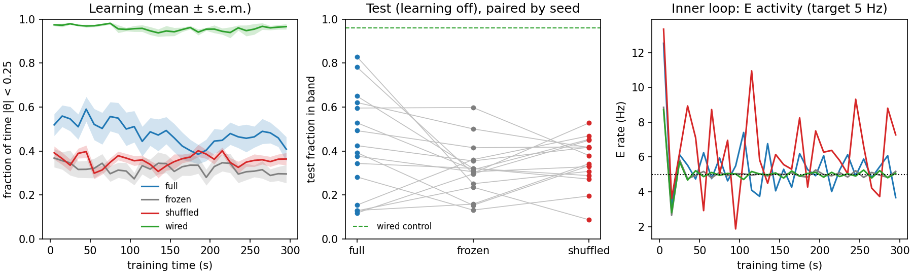
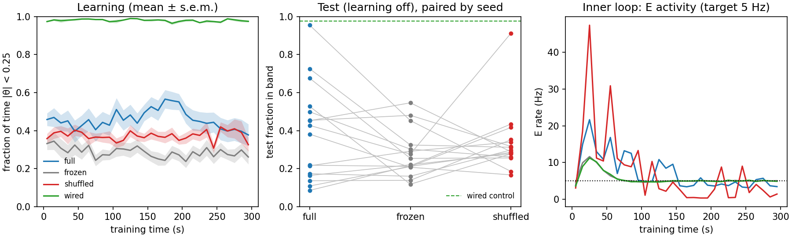

# Balance étude (stage 1): homeostatic inner loop + modulated three-factor learning

Exploratory probe. Standalone JAX (`balance.py`); it does not run the jaxfne
kernels, so nothing here is a claim about them.

## Question

Can a 100-neuron spiking network learn to keep an unstable object upright when
an inner homeostatic loop keeps its activity near fixed rates, and the only
learning signal is a scalar modulator "the error just got smaller"?

## Model

| part | definition |
|---|---|
| task | $d\theta = (a\theta + b u)\,dt + \sigma\,dW_t$, $a=1\,\mathrm{s^{-1}}$ (unstable), $\lvert\theta\rvert>1$ = failure, reset to $U(-0.3,0.3)$ |
| network | 20 sensory (Poisson, Gaussian tuning over $\theta$), 48 E, 12 I, 10 up-motor, 10 down-motor; LIF, $dt=1$ ms |
| action | $u = u_{max}\tanh((\bar r_{up}-\bar r_{down})/10\,\mathrm{Hz})$ |
| inner loop (RBD) | threshold $H_i$: $\tau_H\dot H_i = \rho_i/r^*_i - 1$; each neuron's plastic excitatory input sum held at its initial value |
| outer signal | $M = -\tfrac{d}{dt}\lvert\theta\rvert_{filt}$, failure $=-1$ pulse, centred by a 20 s running mean |
| learning | $\dot w_{ij} = \eta\,M\,e_{ij}$, eligibility $\tau_e\dot e_{ij} = -e_{ij} + \tau_e\,s_i\,x_j$ (post spike × pre trace) |

Plastic synapses: excitatory (sensory, E) onto E and motor neurons.

## Conditions (paired by network seed)

| condition | learning | modulator |
|---|---|---|
| full | on | own |
| frozen | off | — |
| shuffled | on | another agent's (independent of own actions) |
| wired | off | — (hand-wired correct sensory→motor map; positive control) |

Train 300 s, then test 60 s with learning off (inner loop stays on).

## Protocol (fixed before the confirmatory run)

- η is chosen on pilot seeds 0–7 only; confirmatory seeds 1000–1015 are run once.
- Primary metric: test fraction of time with $\lvert\theta\rvert<0.25$ ("in band").
- **P1** full > frozen in ≥13/16 paired seeds and mean difference ≥ 0.10.
- **P2** full > shuffled in ≥13/16 paired seeds and mean difference ≥ 0.10.
- **P3** activity held: every learning agent's test E rate within 0.5–2× its 5 Hz target.
- **P4** positive control: wired in-band ≥ 0.6.

**Frozen before the confirmatory run: η = 1.0.** Pilot (seeds 0–7, 300 s train,
model otherwise unchanged; test in-band, paired wins out of 8):

| η | full | frozen | shuffled | full−frozen | full−shuffled | test E Hz (full / shuffled) |
|---|---|---|---|---|---|---|
| 0.01 | 0.415 | 0.363 | 0.355 | 6/8, +0.052 | 5/8, +0.060 | 5.0 / 5.0 |
| 0.05 | 0.459 | 0.363 | 0.366 | 5/8, +0.096 | 4/8, +0.093 | 5.0 / 5.1 |
| 0.2 | 0.433 | 0.363 | 0.317 | 4/8, +0.070 | 5/8, +0.116 | 5.2 / 6.6 |
| 1.0 | 0.494 | 0.363 | 0.342 | 7/8, +0.130 | 8/8, +0.152 | 6.9 / 9.0 |

Wired control: 0.962 in band, 0 failures/min.

Secondary (reported, not gated): failures per minute, motor-map index
(> 0 when θ>0 sensors drive the down pool and θ<0 sensors the up pool).

## Result (confirmatory, seeds 1000–1015, η = 1.0): FAIL

| criterion | observed | verdict |
|---|---|---|
| P1 full > frozen | 11/16 wins, +0.114 | FAIL (wins) |
| P2 full > shuffled | 13/16 wins, +0.073 | FAIL (difference) |
| P3 E rate 2.5–10 Hz | 27/32 learning agents (range 4.8–16.1 Hz) | FAIL |
| P4 wired ≥ 0.6 | 0.961 | PASS |

Test in-band means: full 0.428, frozen 0.313, shuffled 0.355, wired 0.961.
Motor-map index: full +0.19, frozen +0.00, shuffled −0.26, wired +6.0.



Reading (inferred, not tested):
- No sensory→motor map is learned: the map index stays near 0 against 6 for
  the wired control.
- The full agents' advantage is present in the first 10 s and fades during
  training. It behaves like fast online weight adaptation, not slow structure
  learning.
- With learning on, E rates swing 2–14 Hz: the outer rule and the inner
  homeostatic loop fight, and the inner loop does not hold activity (P3).

Candidate causes for a stage-1b protocol (each a new, separately frozen run):
modulator noise (−d|θ|/dt at 20 ms filtering), credit diluted over every
co-active synapse by the plain Hebbian eligibility, and timescale overlap
between τ_H = 5 s and the learning rate.

## Stage 1b protocol (declared after the stage-1 failure, before any 1b run)

Change (option A, Hamm 2026-10-06): smoother modulator and slower inner loop,
everything else as stage 1.

| parameter | stage 1 | stage 1b |
|---|---|---|
| `tau_err` (error filter feeding M) | 0.02 s | 0.2 s |
| `tau_H` (threshold homeostasis) | 5 s | 50 s |

- η chosen on pilot seeds 0–7 from {0.3, 1, 3, 10}: highest paired-win count
  summed over P1 and P2; ties → larger summed mean difference.
- Confirmatory seeds 2000–2015 (unused by stage 1), run once.
- Pass criteria P1–P4 unchanged.

**Frozen before the 1b confirmatory run: η = 0.3** (rule above). Pilot (seeds 0–7):

| η | full | frozen | shuffled | full−frozen | full−shuffled | test E Hz (full / shuffled) |
|---|---|---|---|---|---|---|
| 0.3 | 0.363 | 0.361 | 0.337 | 4/8, +0.002 | 4/8, +0.026 | 8.5 / 2.8 |
| 1 | 0.380 | 0.361 | 0.395 | 3/8, +0.019 | 3/8, −0.015 | 7.0 / 2.2 |
| 3 | 0.315 | 0.361 | 0.388 | 3/8, −0.046 | 3/8, −0.073 | 6.7 / 0.5 |
| 10 | 0.323 | 0.361 | 0.384 | 2/8, −0.038 | 4/8, −0.060 | 6.2 / 9.7 |

No η shows an effect in the pilot; the confirmatory run proceeds as declared.

### Stage 1b result (seeds 2000–2015, η = 0.3): FAIL

| criterion | observed | verdict |
|---|---|---|
| P1 full > frozen | 9/16 wins, +0.112 | FAIL (wins) |
| P2 full > shuffled | 8/16 wins, +0.051 | FAIL |
| P3 E rate 2.5–10 Hz | 11/32 learning agents (range 0.1–24.9 Hz) | FAIL |
| P4 wired ≥ 0.6 | 0.976 | PASS |

Test in-band means: full 0.387, frozen 0.276, shuffled 0.337. Map index: full +0.17.
Reading (inferred): smoothing removed the fast-adaptation effect of stage 1
without producing a learned map, and the slower inner loop held rates worse.



## Stage 1c protocol (option B; declared before any 1c run)

Change (Hamm 2026-10-06): only sensory→motor excitatory synapses are plastic;
every other parameter as stage 1 (`tau_err` 0.02 s, `tau_H` 5 s). The input
budget then holds each motor neuron's summed sensory input.

- η chosen on pilot seeds 0–7 from {0.3, 1, 3, 10} by the stage-1b rule.
- Confirmatory seeds 3000–3015, run once. P1–P4 unchanged.

**Frozen before the 1c confirmatory run: η = 1.0.** Pilot (seeds 0–7):

| η | full | frozen | shuffled | full−frozen | full−shuffled | test E Hz (full / shuffled) |
|---|---|---|---|---|---|---|
| 0.3 | 0.456 | 0.363 | 0.453 | 5/8, +0.093 | 3/8, +0.003 | 5.0 / 5.0 |
| 1 | 0.565 | 0.363 | 0.265 | 6/8, +0.202 | 7/8, +0.301 | 5.0 / 5.0 |
| 3 | 0.386 | 0.363 | 0.353 | 4/8, +0.023 | 3/8, +0.033 | 5.0 / 5.0 |
| 10 | 0.306 | 0.363 | 0.377 | 3/8, −0.058 | 3/8, −0.072 | 5.0 / 5.0 |

### Stage 1c result (seeds 3000–3015, η = 1.0): FAIL (P2 only)

| criterion | observed | verdict |
|---|---|---|
| P1 full > frozen | 13/16 wins, +0.192 | PASS |
| P2 full > shuffled | 10/16 wins, +0.123 | FAIL (wins) |
| P3 E rate 2.5–10 Hz | 32/32 learning agents (4.9–5.1 Hz) | PASS |
| P4 wired ≥ 0.6 | 0.844 | PASS |

Test in-band means: full 0.511, frozen 0.318, shuffled 0.388, wired 0.844.
Map index: full +0.33, frozen +0.01, shuffled −0.10.


Reading (inferred, not tested):
- Restricting plasticity to sensory→motor synapses fixes the inner-loop
  conflict: E rates stay at 5 Hz in every agent.
- Full agents improve over the first ~60 s (0.46 → 0.70 in band), then decline
  to ~0.5: learning followed by erosion.
- The frozen wired control also degrades late in training (0.97 → 0.87).
  Motor-neuron threshold homeostasis (target 10 Hz per neuron) may be
  flattening the up/down asymmetry the controller needs; the same pull would
  erode a learned map.

## Reproduce

```bash
python artifacts/etudes/hdp_balance/balance.py --eta <frozen eta> --seed0 1000 --n-seeds 16 --out artifacts/etudes/hdp_balance/confirm.json
```
python artifacts/etudes/hdp_balance/balance.py --eta 0.3 --seed0 2000 --n-seeds 16 --set tau_err=0.2 tau_H=50 --out artifacts/etudes/hdp_balance/confirm_1b.json
python artifacts/etudes/hdp_balance/balance.py --eta 1.0 --seed0 3000 --n-seeds 16 --plastic-scope sensory_motor --out artifacts/etudes/hdp_balance/confirm_1c.json
python artifacts/etudes/hdp_balance/verdict.py <result.json>
python artifacts/etudes/hdp_balance/figure.py <result.json>
```
