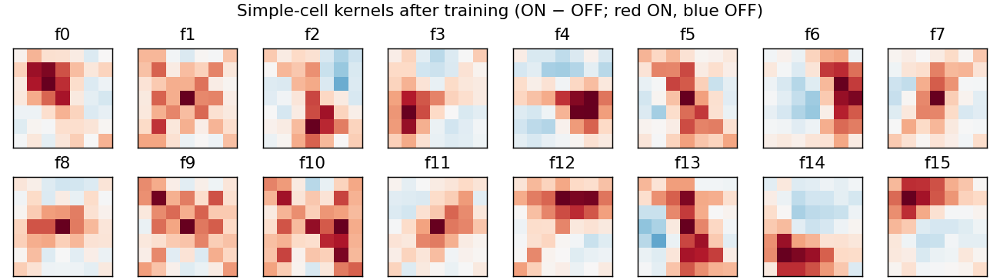

# Predictive Coding Light (PCL) étude

Target: N'dri, Barbier, Teulière, Triesch, "Predictive Coding Light",
*Nat Commun* 16:8880 (2025), doi:10.1038/s41467-025-64234-z. Reference code:
github.com/comsee-research/Predictive-Coding-Light (C++, event-driven).

Standalone first (Hamm 2026-10-06): faithful LIF + PCL rule outside the jaxfne
kernels; port to the registrable HDP kernel after the gates pass. No third
factor until the published model is reproduced.

## Model (paper Methods)

- LIF, event-driven: on each input event
  $V \leftarrow \max(V_{min},\ V e^{-\Delta t/\tau_m} + w_i - \eta_{RP} e^{-(t-t_s)/\tau_{RP}})$;
  spike at $V \ge V_\theta$, reset to $V_{reset}$.
- Causal STDP on every connection, applied at each postsynaptic spike $t_s$ to
  every presynaptic event $t_i$ since the previous update:
  $\Delta w = (w_{max}-w)\eta_+\,\eta_{LTP} e^{-(t_s-t_i)/\tau_{LTP}} + w\,\eta_-\,\eta_{LTD} e^{-(t_i-t_{s-1})/\tau_{LTD}}$, $w \ge 0$.
- L1 normalization of incoming weights per connection type to $\lambda$.
- Prediction is not sent as an error signal: learned inhibition (local
  lateral, distant lateral, top-down) cancels the predictable spikes.

## Gate P0: Fig. 2 (inhibitory STDP removes the most predictable spikes) — PASS

`pcl_fig2.py`: neuron 0 inhibits neurons 1–3, whose inputs copy 90 / 50 / 10 %
of neuron 0's spikes 1 ms later; 140 training samples × 10 epochs, 35 test
samples, 3 networks. Acceptance: learned weights and suppression both ordered
neuron 1 > 2 > 3 in every network.

| neuron (predictable fraction) | 1 (90 %) | 2 (50 %) | 3 (10 %) |
|---|---|---|---|
| final inhibitory weight (mV, mean of 3) | 38.08 | 23.87 | 15.15 |
| spike suppression (mean of 3) | 0.693 | 0.482 | 0.315 |

Per network suppression: [0.677, 0.489, 0.293], [0.700, 0.473, 0.327],
[0.701, 0.483, 0.323]. The fixed point does not depend on the initial weight
(w0 = 0.1, 1, 5, 20 give identical final weights; w0 is consumed: weight
trajectories differ after the first sample).

Observed, not in the paper's text: neuron 3 loses 32 % of its spikes though
only 10 % are predictable, so the learned inhibition also removes some
unpredictable spikes. The paper's Fig. 2d values were not available here for
a numeric comparison.

## Gate C1: small column (protocol declared before the pilot)

`pcl_column.py`. Input 16×16×2 synthetic events: a bright bar (width 2 px)
at one of 8 orientations drifting along its normal at 0.13 px/ms for 200 ms,
ON/OFF events (Poisson, mean 3) where pixels enter/leave the bar, 2 Hz noise.
Simple layer 4×4 positions × 16 features (7×7×2 receptive fields, stride 3);
complex layer 2×2 × 8 features (3×3 simple positions each). Connections:
input→simple, simple→complex (excitatory, shared kernels), local lateral
inhibition in both layers (shared), distant lateral inhibition (simple cells
at other positions) and top-down inhibition (complex→simple cells they cover),
both per neuron. Clock-driven, dt = 0.5 ms.

Training: phase 1 learns excitatory + local inhibition with distant/top-down
inhibition off; phase 2 learns distant + top-down inhibition with everything
else frozen (reference code `STDP_LEARNING` = excitatory / inhibitory).
Test (learning off, 20 sequences per orientation): (a) PCL, (b) distant and
top-down inhibition removed, (c) as (b) with simple-cell spikes removed at
random to match (a)'s count.

Acceptance, each in 3/3 confirmatory seeds (10, 11, 12):
- **A1** orientation tuning: median OSI of responsive simple cells (≥ 0.5
  spikes/sequence) after phase 1 ≥ 0.3 and above the untrained network's.
- **A2** energy: simple-cell spikes (a) ≤ 0.9 × (b).
- **A3** information: 5-fold cross-validated orientation decoding (logistic
  regression on log spike counts, simple + complex) (a) > (c).

Pilot seed 0 may set stimulus parameters and phase lengths only; model
parameters stay at paper values.

Pilot (seed 0):

| stimulus, phase-1 length | median OSI (untrained) | responsive cells | simple spikes (a)/(b) | decoding (a) / (b) / (c) |
|---|---|---|---|---|
| bars, 600 | 0.107 (0.045) | 251 | 0.53 | 0.888 / 0.931 / 0.356 |
| bars, 2400 | 0.122 (0.045) | 170 | 0.54 | 0.806 / 0.794 / 0.500 |
| gratings (period 6 px), 600 | 0.042 (0.019) | 256 | 0.57 | 0.681 / 0.719 / 0.463 |

**Frozen for the confirmatory run: bars, 600 + 300 sequences.** Longer
training and gratings both lowered tuning or decoding. Kernels drift toward
centre blobs (`pilot/*_kernels.png`): every bar crosses the centre of every
receptive field, so a centre detector is driven at all orientations. A1 is
expected to fail; the confirmatory run records it rather than tuning further.

### C1 result (seeds 10, 11, 12): A2 and A3 PASS, A1 FAIL

| seed | median OSI (untrained) | simple spikes (a)/(b) | decoding (a) PCL | (b) no inh. | (c) random, matched |
|---|---|---|---|---|---|
| 10 | 0.123 (0.053) | 0.519 | 0.919 | 0.900 | 0.481 |
| 11 | 0.121 (0.045) | 0.519 | 0.913 | 0.888 | 0.419 |
| 12 | 0.100 (0.049) | 0.511 | 0.850 | 0.869 | 0.538 |

- **A1 FAIL** (3/3): tuning roughly doubles over the untrained network but
  stays near 0.1, below 0.3.
- **A2 PASS** (3/3): learned distant + top-down inhibition removes ~48 % of
  simple-cell spikes.
- **A3 PASS** (3/3): at matched spike removal, PCL decodes orientation at
  0.85–0.92 against 0.42–0.54 for random removal, and stays within 0.02 of
  the uninhibited network. Random removal matches the simple-cell count only
  approximately (≈17 000 vs ≈13 600 spikes, more left in the control), so the
  comparison favours the control.

Reading: the paper's central claim, that learned inhibition removes about half
the spikes while keeping the information, holds in this small column. The
V1-like receptive fields do not form with this stimulus set.



## Gate C1b: localized edges

Hamm 2026-10-07. Declared before the pilot. C1 failed A1 because every bar
crosses every receptive-field centre. C1b changes only the stimulus: the bar
is cut to a segment of length L px (`--stim segment --length L`), centred
uniformly within ±6 px along its own axis per sequence, and swept along its
normal as before. Everything else, acceptance A1–A3 included, is as C1.

Pilot (seed 0) may set L ∈ {4, 6, 8} and the phase lengths. Selection rule:
the highest median OSI among settings that keep A2 and A3; ties go to 600 + 300.
Confirmatory seeds 10, 11, 12 run once.

Pilot (seed 0; C1 bars for reference):

| stimulus, phase-1 length | median OSI (untrained) | responsive cells | simple spikes (a)/(b) | decoding (a) / (b) / (c) |
|---|---|---|---|---|
| bars, 600 (C1) | 0.107 (0.045) | 251 | 0.53 | 0.887 / 0.931 / 0.356 |
| L 4, 600 | — | 0 | 0.51 | 0.356 / 0.487 / 0.325 |
| L 6, 600 | 0.081 (—) | 1 | 0.51 | 0.450 / 0.519 / 0.362 |
| L 8, 600 | 0.092 (0.082) | 13 | 0.51 | 0.637 / 0.637 / 0.375 |
| L 8, 2400 | 0.095 (0.082) | 26 | 0.56 | 0.588 / 0.606 / 0.475 |

**Frozen: L 8, 2400 + 300 sequences** (highest OSI; no tie tolerance was
declared). Kernels are no longer centre blobs: they become ON spots tiling
the receptive field, a few elongated (`pilot/c1b_seed0_L8*_kernels.png`), so
features code position more than orientation. A segment reaches few
receptive fields per sequence, so few cells pass the frozen responsiveness
threshold (0.5 spikes/sequence) and A1 measures a small, selected subset.

### C1b result (seeds 10, 11, 12): A2 and A3 PASS, A1 FAIL

| seed | median OSI (untrained) | responsive cells | simple spikes (a)/(b) | decoding (a) PCL | (b) no inh. | (c) random, matched |
|---|---|---|---|---|---|---|
| 10 | 0.078 (0.078) | 22 | 0.564 | 0.600 | 0.644 | 0.344 |
| 11 | 0.090 (0.081) | 29 | 0.582 | 0.662 | 0.738 | 0.506 |
| 12 | 0.063 (0.072) | 27 | 0.566 | 0.569 | 0.550 | 0.350 |

- **A1 FAIL** (3/3): OSI 0.06–0.09, at or below the untrained network in two
  seeds. Localized edges remove the centre blobs but do not produce
  orientation tuning; kernels learn position.
- **A2 PASS** (3/3): ~43 % of simple-cell spikes removed.
- **A3 PASS** (3/3): PCL 0.57–0.66 against 0.34–0.51 for random removal.

Reading: the stimulus was not the only cause of A1 failing. With one
16-feature kernel bank and 7 × 7 fields, sparse localized input is coded by
position first. Orientation tuning may need richer input statistics or more
features; not pursued here.


## Gate K0: Fig. 2 on the jaxfne HDP kernel (Izhikevich) — FAIL (weights, 1/3 seeds); K0b PASS

Hamm 2026-10-07: port PCL to the existing registrable HDP kernel with
Izhikevich neurons, no new neuron model. `pcl_hdp_rule.py` registers rule
`pcl_stdp` (per-edge aux: LTP trace since the last post spike, deferred LTD
sum, post spike trace; soft-bound update and per-group L1 normalization at
post spikes). `pcl_fig2_hdp.py` runs Fig. 2 through
`simulate_edge_recurrent_izhikevich_hdp_registered`, dt = 0.1 ms, RS
Izhikevich (a 0.02, b 0.2, c −65, d 8), GABA_A-indexed inhibitory edges with
τ = 2 ms, inputs as 1 ms current pulses at 1.5× firing threshold.

Unit calibration (declared): the smallest inhibitory weight that blocks a
pulse 1 ms after neuron 0's pulse is 25.7 (native units); the paper's
equivalent is 5.3 mV, so 1 mV ↔ 4.85 native units (w_max = 50 mV ↔ 243).
Blocking is not monotonic above ~10³: very strong inhibition drives v so low
that the quadratic Izhikevich term fires the neuron.

Same acceptance as P0 (weights and suppression ordered 1 > 2 > 3 in every network):

| seed | final w (mV-equivalent) | suppression | weights ordered | suppression ordered |
|---|---|---|---|---|
| 0 | 24.0 / 18.3 / 15.7 | 0.406 / 0.226 / 0.060 | yes | yes |
| 1 | 22.6 / 16.5 / 13.8 | 0.398 / 0.181 / 0.081 | yes | yes |
| 2 | 17.7 / 20.8 / 16.4 | 0.363 / 0.197 / 0.085 | **no** | yes |

Reading: suppression is ordered by predictability in every network, on the
kernel as standalone, at about half the standalone magnitude (0.39 / 0.20 /
0.08 vs 0.69 / 0.48 / 0.32). The weight criterion reads a snapshot: the
end-of-epoch weights are identical across all 10 epochs (deterministic run,
same data each epoch), so they settle within one epoch and the final value
reflects the last training samples. A time-averaged weight is the better
measure; it needs a new declared protocol.

### K0b: time-averaged weights (declared before the run)

Hamm 2026-10-07. Same model, calibration, training and test as K0. Weight
criterion: |w| averaged over every step of the last training epoch (trace
every 10 steps), ordered 1 > 2 > 3 in every network; suppression criterion
unchanged. Fresh confirmatory seeds 10, 11, 12, run once; seeds 0–2 re-run to
show the end-of-epoch weights reproduce K0. No tuning knobs.

**K0b result: PASS** (`fig2_hdp_avg.json`; seeds 0–2 in `fig2_hdp_avg_s012.json`
reproduce K0's weight histories and suppression bit for bit).

| seed | time-averaged w (mV-equivalent) | end-of-epoch w | suppression | averaged ordered | end ordered |
|---|---|---|---|---|---|
| 10 | 22.88 / 20.15 / 16.04 | 19.65 / 22.51 / 18.32 | 0.381 / 0.195 / 0.106 | yes | no |
| 11 | 21.53 / 18.03 / 16.16 | 25.68 / 19.66 / 16.68 | 0.379 / 0.177 / 0.117 | yes | yes |
| 12 | 21.67 / 18.06 / 15.64 | 21.71 / 18.65 / 17.68 | 0.413 / 0.177 / 0.076 | yes | yes |
| 0–2 (K0) | ordered in 3/3 | ordered in 2/3 | ordered in 3/3 | yes | 2/3 |

Reading: on the kernel, inhibitory weights and suppression are both ordered
by predictability once the weight is read as a time average; the snapshot
fails in 1 of 3 fresh networks as in K0. The averaged weights are compressed
(≈ 22 / 19 / 16 mV against 38 / 24 / 15 standalone).

## Gate K2: a third factor, population surprise (declared before the pilot)

Hamm 2026-10-07: add a third factor once the published model reproduces
(K0b). Rule `pcl_stdp_m` (`pcl_hdp_rule.py`) scales the PCL learning rate by
a population surprise signal: with $r$ the population rate of neurons 1–3 and
$r_f$, $r_s$ its exponential traces ($\tau_f$ = 0.5 s, $\tau_s$ = 20 s),
$m = \mathrm{clip}((r_f+\epsilon)/(r_s+\epsilon), 0, 5)$ and
$\eta_{eff} = \eta\,(1 + g(m-1))$. Unpredicted spikes raise the population
rate above its recent mean, so learning speeds up when the network's
predictions fail and returns to the plain rate when they hold. $g = 0$ is
`pcl_stdp` bit for bit (test).

Protocol (`pcl_third_factor.py`): K0 network; phase A, 3 epochs at
predictability 90 / 50 / 10 %; switch to 10 / 50 / 90 %; phase B, one epoch,
from the same switch state in three conditions: fixed ($g$ = 0), gated
($g$ > 0), matched ($g$ = 0 with η scaled by the gated run's mean multiplier
over phase B). Readout $t_{rev}$: seconds after the switch from which the
weight onto neuron 3 stays above the weight onto neuron 1.

Acceptance, in 3/3 confirmatory seeds (10, 11, 12): **T1** gated
$t_{rev}$ < fixed; **T2** gated $t_{rev}$ < matched (the timing of the
factor matters, not only its mean). Pilot seed 0 sets $g \in \{1, 4\}$:
the larger min(fixed − gated, matched − gated).

Pilot (seed 0, $\tau_f$ = 0.5 s, raw-trace readout): $t_{rev}$ = ∞ in all
three conditions at $g$ = 1 and 4. The readout failed, not the learning:
averaged over phase B the weights reverse (15.7 / 18.3 / 22.4 mV at $g$ = 4)
and suppression reverses (test spikes 383 / 327 / 271 against 418 / 410 / 416
without inhibition), but the instantaneous weights fluctuate until the end
of the epoch (the K0 snapshot problem). The modulator is weak: $m$ swings
±40 % within seconds (Poisson noise of a 3-neuron rate over 0.5 s) and rises
only ~7 % in the 20 s after the switch, so the mean multiplier is 1.016 at
$g$ = 4. Receipts: `pilot/k2_seed0_g{1,4}.json`.

### K2b (declared after that pilot, before any confirmatory run)

Two changes, everything else as K2: $\tau_f$ = 2 s (less rate noise), and
$t_{rev}$ read from the trailing 10 s mean of $w_3 - w_1$ (stays > 0 from
$t_{rev}$ on). Pilot seed 0 sets $g \in \{4, 16\}$ by the K2 rule; T1, T2 and
confirmatory seeds 10, 11, 12 unchanged.

K2b pilot (seed 0), $t_{rev}$ in s:

| $g$ | fixed | matched | gated | mean multiplier |
|---|---|---|---|---|
| 4 | 15.3 | 15.4 | 21.3 | 0.996 |
| 16 | 15.3 | 14.6 | 20.9 | 1.135 |

**Frozen: $g$ = 4** (rule: min(fixed − gated, matched − gated) = −6.0
against −6.3). Gating slows re-learning in the pilot; the confirmatory run
proceeds as declared.

### K2b result (seeds 10, 11, 12, $g$ = 4): FAIL (T1, T2)

| seed | fixed | matched | gated | mean multiplier |
|---|---|---|---|---|
| 10 | 136.1 | 136.0 | 136.5 | 0.993 |
| 11 | 15.3 | 15.3 | 15.1 | 1.003 |
| 12 | 18.8 | 18.9 | 18.2 | 0.973 |

- **T1 FAIL** (2/3): gated is faster than fixed in seeds 11 and 12 by 0.2
  and 0.6 s, slower in seed 10 by 0.4 s.
- **T2 FAIL** (2/3): the same pattern against the matched mean.

Reading: the factor is inert here. Its mean multiplier stays within 3 % of
1, so the three conditions learn almost identically (differences ≤ 0.6 s).
The population is three neurons at 20 Hz; their rate is dominated by
Poisson noise and rises only slightly when predictions fail, so surprise
carries little signal. Seed 10's late $t_{rev}$ (136 s) comes from a dip of
the smoothed difference near the end of the epoch in all three conditions.
A useful surprise signal needs a larger population or a per-neuron
(prediction-error) factor; not pursued here.

## Gate K1: the C1 column on the jaxfne HDP kernel — A2 and A3 PASS, A1 FAIL

`pcl_column_hdp.py` runs the C1 column (512 input relays, 256 simple, 32
complex cells, ~99 000 edges, one weight per edge) through the registrable
kernel with rule `pcl_stdp`, dt = 0.5 ms. Inputs are 1 ms current pulses to
relay neurons; each relay spike drives its targets. Calibration as K0 at this
dt: w_cancel = 55.6, 1 mV ↔ 10.49 native units; inputs onto complex cells
carry an extra 10/3 (threshold 3 vs 10 mV).

The kernel needed a membrane floor: without one, paper-strength local
inhibition drives Izhikevich neurons below the quadratic turning point and
they fire (simple-cell spikes 536 → 29 568 when local inhibition is added).
The kernel's opt-in `v_floor` set to −85 mV (20 below rest, the analogue of
PCL's $V_{min}$) restores suppression (536 → 190).

Protocol, acceptance and pilot knobs as C1; settings frozen as C1 (bars,
600 + 300 sequences). Control (c) thins simple-cell counts of (b) post hoc
(binomial, keep = (a)/(b)) instead of removing spikes during the run, so its
complex cells are unaffected; A3 therefore compares simple-cell decoding.

| seed | median OSI (untrained) | simple spikes (a)/(b) | decoding (a) PCL simple | (b) no inh. simple | (c) random, matched |
|---|---|---|---|---|---|
| 0 (pilot) | 0.056 (0.056) | 0.283 | 0.519 | 0.788 | 0.306 |
| 10 | 0.053 (0.054) | 0.287 | 0.594 | 0.806 | 0.275 |
| 11 | 0.048 (0.054) | 0.280 | 0.706 | 0.700 | 0.275 |
| 12 | 0.053 (0.056) | 0.301 | 0.744 | 0.681 | 0.287 |

- **A1 FAIL** (3/3): no tuning; trained OSI equals or falls below untrained.
- **A2 PASS** (3/3): learned distant + top-down inhibition removes ~71 % of
  simple-cell spikes (C1: ~48 %).
- **A3 PASS** (3/3): at matched counts PCL decodes at 0.59–0.74 against
  0.28–0.29 for random removal.

Reading: the central claim survives the port. Inhibition removes more spikes
than in C1 and decoding stays well above matched random removal; against the
uninhibited network it is mixed (−0.21 in seed 10 and −0.27 in the pilot,
+0.01 and +0.06 in seeds 11 and 12), where C1 stayed within 0.02. The
excitatory phase does not build orientation tuning on the Izhikevich kernel.

## Gate K1h: K1 with the rule's traces in the H state

Protocol, declared before the confirmatory runs: K1 unchanged except the rule,
`pcl_stdp_h2` (`../pcl_h/pcl_h_rule.py`; H holds one presynaptic trace per tau
class, 7 ms onto simple and 40 ms onto complex cells, and the post trace; per
edge only the snapshot and the deferred LTD sum). Seeds 10, 11, 12, run once.
Pass: in every seed, simple and complex spike counts with and without the
learned inhibition, matched random removal and all decoding values equal those
of K1, and the A1–A3 outcomes are the same. Weights are compared and reported,
not gated: the snapshot form subtracts two traces, so float rounding differs.
Smoke (seed 0, 6 + 6 sequences, 5 tests per orientation): spikes, decoding,
OSI and keep fraction identical; weights max relative difference 2e-7.

Result: FAIL on the declared equality, in 2 of 3 seeds; A1–A3 outcomes
unchanged in all three (A1 FAIL, A2 and A3 PASS).

| seed | gated fields vs K1 | max abs weight diff | decoding pcl / no-inh / random (K1 → K1h) |
|---|---|---|---|
| 10 | all equal | 0.0012 | unchanged |
| 11 | spikes, decoding, keep_q differ | 130 | 0.71/0.70/0.28 → 0.69/0.74/0.21 |
| 12 | spikes, decoding, keep_q, OSI differ | 135 | 0.74/0.68/0.29 → 0.68/0.71/0.26 |

Divergence, seed 11 (`k1h_divergence.py`, both rules in lockstep from the
same weights and draws; its runner matches the driver's bit for bit). All
weights are equal until phase 1 sequence 1, step 133 (66.5 ms), where one
`c_loc` edge (797 → 793) updates to −419.5366 under `pcl_stdp` and −419.53656
under `pcl_stdp_h2`: one float32 ulp, from identical weights and spikes. The
sequence ends 3 ulp apart on 2 edges with equal spike counts; the gap reaches
14.7 at the end of phase 1 and 130 at the end of phase 2; total spike counts
per sequence first differ at phase 1 sequence 497. So the split is
arithmetic rounding amplified by the spiking dynamics, not a rule difference (observed); that the snapshot
subtraction is the rounding site is inferred.

## Gate K1h-nf: H-state rule against the float32 noise floor

Hamm 2026-10-08. Declared and committed before any run. K1h stands as
declared (FAIL on equality); this gate asks whether the H-state rule differs
from `pcl_stdp` by more than a one-ulp perturbation of `pcl_stdp` itself.

Fresh seeds 13, 14, 15 (none run before for K1 or K1h), each run once, K1
settings unchanged. Per seed three runs of `pcl_column_hdp.py`:
base (`--rule pcl_stdp`), nudge (`--rule pcl_stdp --nudge-ulp 1`: every
nonzero initial phase-1 weight moved one float32 ulp up) and H
(`--rule pcl_stdp_h2`). Fields: the seven decoding values
(pcl, no_inh: simple, complex, both; random: simple).

- Noise floor T = max over seeds and fields of |nudge − base|.
- Pass: max over seeds and fields of |H − base| ≤ T, and in every seed the
  A1–A3 verdicts of H equal those of base.
- T = 0 (the nudge changed nothing) makes the gate ERROR, not PASS.
- On PASS the per-edge rule `pcl_stdp` is retired in favour of
  `pcl_stdp_h2`; on FAIL both stay. Evaluated by `k1h_nf_gate.py`.

Result: PASS. T = 0.0688; max |H − base| = 0 in every gated field of every
seed; A1–A3 the same in all three (A1 FAIL, A2 and A3 PASS).

| seed | nudge vs base: max decoding diff / max weight diff | H vs base: gated fields / max weight diff |
|---|---|---|
| 13 | 0.0688 / 123 | all equal / 0.0014 |
| 14 | 0.0500 / 153 | all equal / 0.0012 |
| 15 | 0.0688 / 126 | all equal / 0.0016 |

H also matched base in spike counts, keep fraction and OSI. Its rounding
differences stayed below a spike in all three seeds, as in K1h seed 10; a
one-ulp change of the initial weights alone moves decoding by up to 0.069.
The H run took about 20 % longer than base (868 s against 720 s).

Retirement, for new work only: `pcl_stdp_h2` replaces `pcl_stdp`, which is
not removed. `pcl_stdp` stays the
driver default and is kept, unchanged, to reproduce K1 and the replication
results; the commands recorded above stay valid.

## Control O1: hand-set oriented kernels

Hamm 2026-10-08. Declared and committed before the confirmatory runs. A1
failed in C1, C1b and K1, with and without weight sharing. O1 asks whether
the A1 measurement can reach its threshold when the simple-cell kernels are
oriented by construction.

`pcl_orient_control.py`: the C1 column with the 16 `s_exc` kernels set by
hand (feature 2k + q: bar orientation kπ/8; ON lobe one pixel ahead of the
receptive-field centre along the bar normal and OFF lobe one pixel behind,
or the reverse; Gaussian across the bar, σ = 0.5 px, flat along it;
normalized like the initial weights), local inhibition at its random initial
weights, no learning, distant and top-down inhibition off, as in the A1
measurement. Same OSI, responsiveness threshold (0.5 spikes per sequence)
and decoding as A1. Seeds 10, 11, 12, run once, 20 test sequences per
orientation, for each frozen stimulus: bars (C1) and segments of length 8
(C1b).

- O1 reaches A1: median OSI of the oriented network ≥ 0.3 in every seed of
  a stimulus. Then the A1 failures are failures of learning.
- O1 misses A1: median OSI < 0.3 in any seed. Then A1 at 0.3 cannot be met
  under this stimulus and OSI measure even by oriented kernels, and the A1
  outcomes of C1, C1b and K1 are not evidence about learning.
- Reported, not gated: the untrained network's OSI, responsive cells and
  decoding.

Smoke (seed 0, bars, 5 sequences per orientation): median OSI 0.27
oriented against 0.09 untrained; decoding 1.00 against 0.48.

## Deviations from the paper

| item | paper | here | reason |
|---|---|---|---|
| Fig. 2 normalization | outgoing L1 | none | λ = 6500 over 3 synapses is incompatible with $w_{max}$ = 50; the reference code skips normalization for a single lateral synapse and its outgoing normalization line is commented out |
| learning-rate scale | Table 2 η | Table 2 η used directly | Table values equal the code's η × λ (0.000408 × 6500 = 2.652) |
| spike-rate adaptation | not described | omitted | present in the reference code (`DELTA_SRA`), absent from the paper |
| initial inhibitory weight | "same value" | 1 mV | not given; result shown independent of it |
| K1 neuron | LIF with $V_{min}$ | RS Izhikevich, `v_floor` −85 mV | Hamm 2026-10-07: Izhikevich only; floor blocks the quadratic blow-up |
| K1 weight sharing | convolutional | one weight per edge | kernel stores per-edge weights |
| K1 random control | spikes removed during the run | post-hoc thinning of simple-cell counts | no per-spike removal hook in the kernel |

## Reproduce

```bash
python artifacts/etudes/pcl/pcl_fig2.py --out artifacts/etudes/pcl/fig2.json
python artifacts/etudes/pcl/pcl_column.py --seed 10 --out artifacts/etudes/pcl/confirm/c1_seed10.json
python artifacts/etudes/pcl/figure_column.py artifacts/etudes/pcl/confirm/c1_seed10.npz
python artifacts/etudes/pcl/pcl_column.py --seed 10 --stim segment --length 8 --n-exc 2400 --out artifacts/etudes/pcl/confirm/c1b_seed10.json
python artifacts/etudes/pcl/pcl_fig2_hdp.py --out artifacts/etudes/pcl/fig2_hdp.json
python artifacts/etudes/pcl/pcl_column_hdp.py --seed 10 --out artifacts/etudes/pcl/confirm/k1_seed10.json
```
