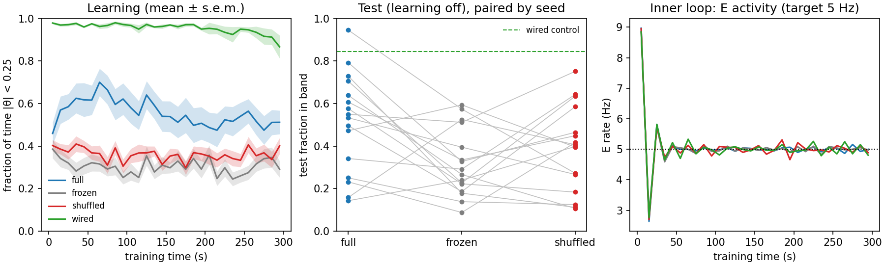
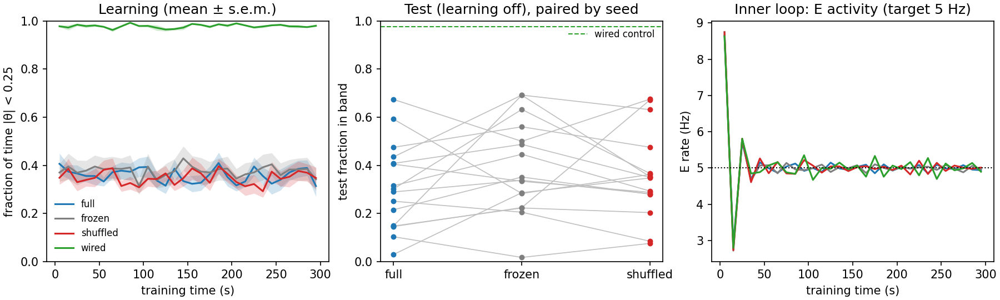

# Étude: homeostatic balance learning

**Status:** exploratory; every stage fails at least one criterion  
**Bundle:** `artifacts/etudes/hdp_balance/` (standalone JAX, not the jaxfne kernels)

## Question

Can a 100-neuron spiking network learn to keep an unstable object upright when
an inner homeostatic loop (RBD) holds its activity near fixed rates and the
only learning signal is a scalar modulator, "the error just got smaller"?

## Model

| part | definition |
|---|---|
| task | $d\theta = (a\theta + b u)\,dt + \sigma\,dW_t$, $a = 1\,\mathrm{s^{-1}}$; $\lvert\theta\rvert > 1$ is a failure |
| network | 20 sensory (Gaussian tuning over $\theta$), 48 E, 12 I, 10 up-motor, 10 down-motor; LIF, $dt = 1$ ms |
| action | $u = u_{max}\tanh((\bar r_{up} - \bar r_{down}) / 10\,\mathrm{Hz})$ |
| inner loop | threshold $H_i$: $\tau_H \dot H_i = \rho_i / r^*_i - 1$; plastic input sums held at their initial values |
| modulator | $M = -\tfrac{d}{dt}\lvert\theta\rvert_{filt}$, failure $= -1$ pulse, centred by a 20 s running mean |
| learning | $\dot w_{ij} = \eta\, M\, e_{ij}$, eligibility $\tau_e \dot e_{ij} = -e_{ij} + \tau_e s_i x_j$ |

Conditions, paired by network seed: full (own modulator), frozen (no
learning), shuffled (another agent's modulator) and wired (hand-wired
sensory→motor map, positive control). Train 300 s, test 60 s with learning off.

Criteria, on 16 confirmatory seeds run once after η is chosen on pilot seeds:
**P1** full > frozen in ≥ 13/16 pairs and by ≥ 0.10 in-band fraction;
**P2** the same against shuffled; **P3** every learning agent's test E rate
within 2.5–10 Hz; **P4** wired in-band ≥ 0.6.

## Stages

| stage | change | η | P1 | P2 | P3 | P4 | seeds | commit |
|---|---|---|---|---|---|---|---|---|
| 1 | — | 1.0 | FAIL (11/16, +0.114) | FAIL (13/16, +0.073) | FAIL (27/32) | PASS (0.961) | 1000–1015 | `434ec44d` |
| 1b | error filter 0.2 s, $\tau_H$ 50 s | 0.3 | FAIL (9/16, +0.112) | FAIL (8/16, +0.051) | FAIL (11/32) | PASS (0.976) | 2000–2015 | `301d261b` |
| 1c | only sensory→motor synapses plastic | 1.0 | PASS (13/16, +0.192) | FAIL (10/16, +0.123) | PASS (32/32) | PASS (0.844) | 3000–3015 | `301d261b` |
| 1d | 1c + pooled motor homeostasis | 10 | FAIL (5/16, −0.083) | FAIL (7/16, −0.050) | PASS (32/32) | PASS (0.977) | 4000–4015 | `53c6e48d` |

## Reading

- Stage 1: no sensory→motor map forms; the full agents' early advantage
  fades during training, and with all excitatory synapses plastic the
  modulated rule and the inner loop fight (E rates 4.8–16.1 Hz).
- Stage 1c: restricting plasticity to sensory→motor synapses holds every
  agent at 5 Hz and gives the only P1 pass; agents improve over the first
  ~60 s, then erode, and the frozen wired control erodes too.
- Stage 1d: pooled motor homeostasis keeps the wired control at 0.98, which
  supports the erosion reading, but the pilot rule chose η = 10, whose pilot
  map index was already ≈ 0. η = 0.3 led the pilot on effect size; it needs
  a new protocol and fresh seeds.

## Figures

=== "Stage 1c"

    

=== "Stage 1d"

    

=== "Stage 1b"

    

=== "Stage 1"

    

## Reproduce

```bash
python artifacts/etudes/hdp_balance/balance.py --eta 1.0 --seed0 3000 --n-seeds 16 --plastic-scope sensory_motor --out artifacts/etudes/hdp_balance/confirm_1c.json
python artifacts/etudes/hdp_balance/verdict.py artifacts/etudes/hdp_balance/confirm_1c.json
```

Every stage's protocol, pilot table and command: `artifacts/etudes/hdp_balance/README.md`.
