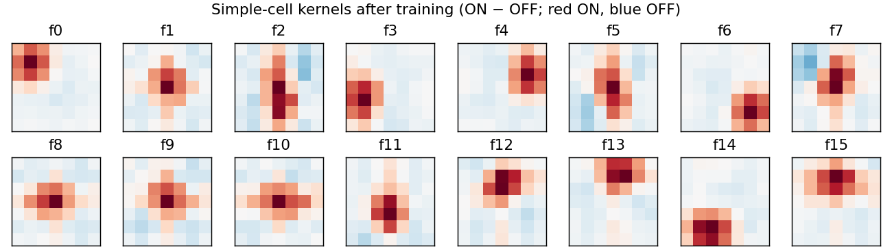

# Étude: Predictive Coding Light

**Status:** Fig. 2 reproduced standalone and on the HDP kernel; central claim reproduced in a small column; orientation tuning not reproduced  
**Bundle:** `artifacts/etudes/pcl/`

## Claim and source

N'dri, Barbier, Teulière, Triesch, "Predictive Coding Light", *Nat Commun*
16:8880 (2025), doi:[10.1038/s41467-025-64234-z](https://doi.org/10.1038/s41467-025-64234-z).
Learned inhibition (local lateral, distant lateral, top-down) removes the
predictable spikes of a spiking network without sending an explicit error
signal, and the remaining spikes keep the stimulus information.

## Model

Input here is synthetic: 16 × 16 × 2 ON/OFF event streams from drifting
bars or bar segments at 8 orientations.

- LIF: on each input $V \leftarrow \max(V_{min},\ V e^{-\Delta t/\tau_m} + w_i - \eta_{RP} e^{-(t-t_s)/\tau_{RP}})$; spike at $V \ge V_\theta$.
- Causal STDP at each postsynaptic spike $t_s$ over presynaptic events $t_i$ since the previous one:
  $\Delta w = (w_{max}-w)\eta_+\eta_{LTP} e^{-(t_s-t_i)/\tau_{LTP}} + w\,\eta_-\eta_{LTD} e^{-(t_i-t_{s-1})/\tau_{LTD}}$, $w \ge 0$.
- L1 normalization of each neuron's incoming weights per connection type.

On the jaxfne kernel the same update is the registered HDP rule `pcl_stdp`
(per-edge aux state: LTP trace, deferred LTD sum, post-spike trace), run by
the registrable Izhikevich kernel.

## Gates

| gate | protocol | verdict | seeds | commit |
|---|---|---|---|---|
| P0 | Fig. 2, standalone: inhibition onto neurons with 90 / 50 / 10 % predictable input | PASS: weights and suppression ordered in 3/3 | 3 networks | `81092017` |
| C1 | column, standalone, drifting bars | A1 FAIL · A2 PASS · A3 PASS | 10, 11, 12 | `e0642350` |
| K0 | Fig. 2 on the HDP kernel, rule `pcl_stdp` | suppression ordered 3/3; end-of-epoch weights ordered 2/3: FAIL | 0, 1, 2 | `dd8e89df` |
| K0b | K0 with weights averaged over the last training epoch | PASS: averaged weights and suppression ordered in 3/3 | 10, 11, 12 | `a1cd500f` |
| K1 | C1 column on the HDP kernel | A1 FAIL · A2 PASS · A3 PASS | 10, 11, 12 | `8d80f7ac` |
| C1b | C1 with localized edge segments | A1 FAIL · A2 PASS · A3 PASS | 10, 11, 12 | `5bf6b1e0` |

Column acceptance, each in 3/3 seeds: **A1** median OSI of responsive simple
cells ≥ 0.3 and above the untrained network; **A2** simple-cell spikes with
learned distant and top-down inhibition ≤ 0.9 × without; **A3** orientation
decoding with that inhibition > decoding after random removal of the same
number of spikes. Settings are chosen on pilot seed 0; seeds 10–12 run once.

## Results

**P0.** Suppression 0.69 / 0.48 / 0.32 and final weights 38 / 24 / 15 mV for
90 / 50 / 10 % predictable input; the fixed point does not depend on the
initial weight.

**Columns** (simple-cell spikes kept, decoding accuracy):

| gate | median OSI (untrained) | spikes kept | decoding: inhibition / none / random removal |
|---|---|---|---|
| C1 | 0.10–0.12 (0.05) | 0.51–0.52 | 0.85–0.92 / 0.87–0.90 / 0.42–0.54 |
| K1 | 0.05 (0.05) | 0.28–0.30 | 0.59–0.74 / 0.68–0.81 / 0.28–0.29 |
| C1b | 0.06–0.09 (0.07–0.08) | 0.56–0.58 | 0.57–0.66 / 0.55–0.74 / 0.34–0.51 |

K1 decodes simple cells only (random removal there is post-hoc thinning of
counts); C1 and C1b decode simple and complex cells.

**K0.** Suppression is ordered by predictability in every network
(0.39 / 0.20 / 0.08), about half the standalone magnitude. The weight order
fails in one network; weights settle within one epoch, so the end value
reflects the last samples.

**K0b.** Read as a time average over the last training epoch, the weights are
ordered by predictability in every network (≈ 22 / 19 / 16 mV-equivalent,
compressed against 38 / 24 / 15 standalone), on fresh seeds and on the K0
seeds alike. The end-of-epoch snapshot still fails in one fresh network.

## Reading

- Learned inhibition removes 42–72 % of simple-cell spikes while decoding stays
  well above matched random removal, standalone and on the kernel. Against the
  uninhibited network, decoding is kept in C1 and mixed in K1 and C1b.
- Orientation tuning does not form. With bars, every receptive-field centre
  is crossed at all orientations and kernels become centre detectors; with
  localized segments, kernels become position spots.
- On the Izhikevich kernel, strong inhibition drives the membrane past the
  quadratic turning point and fires the neuron. K1 runs with the kernel's
  `v_floor` at −85 mV, the analogue of the model's $V_{min}$.

## Figures

=== "C1b kernels"

    

=== "C1 kernels"

    

## Deviations

| item | paper | here |
|---|---|---|
| Fig. 2 normalization | outgoing L1 | none (λ incompatible with $w_{max}$ for 3 synapses) |
| spike-rate adaptation | in the reference code only | omitted |
| kernel neuron (K0, K1) | LIF with $V_{min}$ | Izhikevich RS, `v_floor` −85 mV (K1) |
| kernel weights (K1) | shared kernels | one weight per edge |

## Reproduce

```bash
python artifacts/etudes/pcl/pcl_fig2.py --out artifacts/etudes/pcl/fig2.json
python artifacts/etudes/pcl/pcl_column.py --seed 10 --out artifacts/etudes/pcl/confirm/c1_seed10.json
python artifacts/etudes/pcl/pcl_column_hdp.py --seed 10 --out artifacts/etudes/pcl/confirm/k1_seed10.json
```

Protocols, pilots and every command: `artifacts/etudes/pcl/README.md`.
