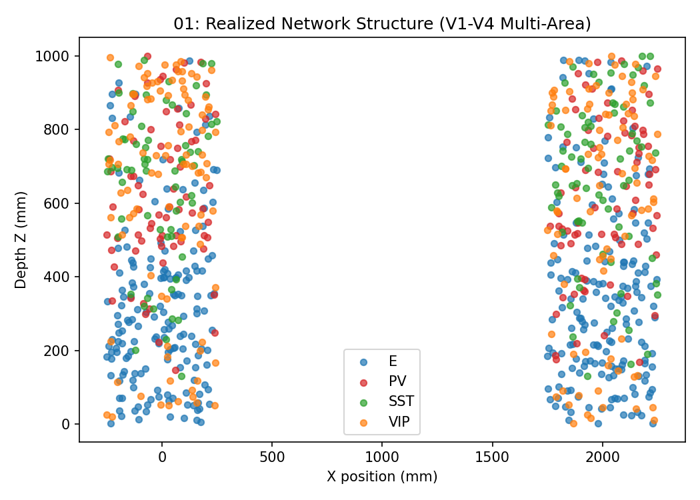
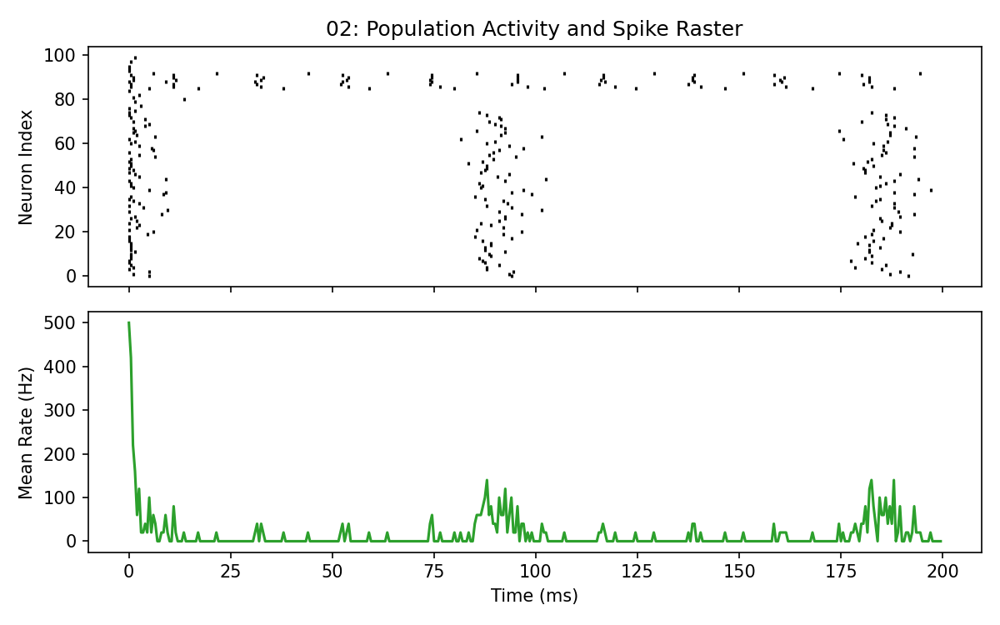
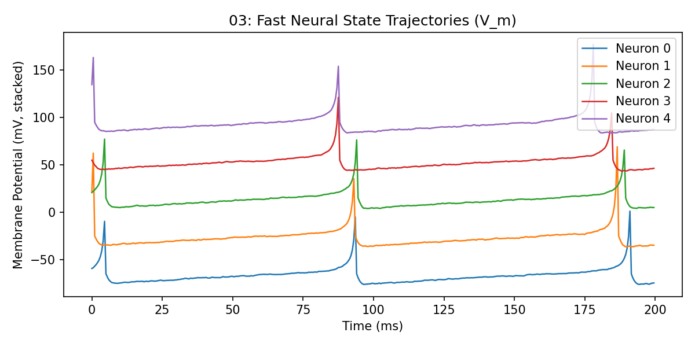
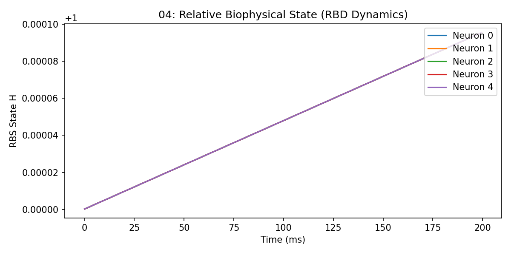
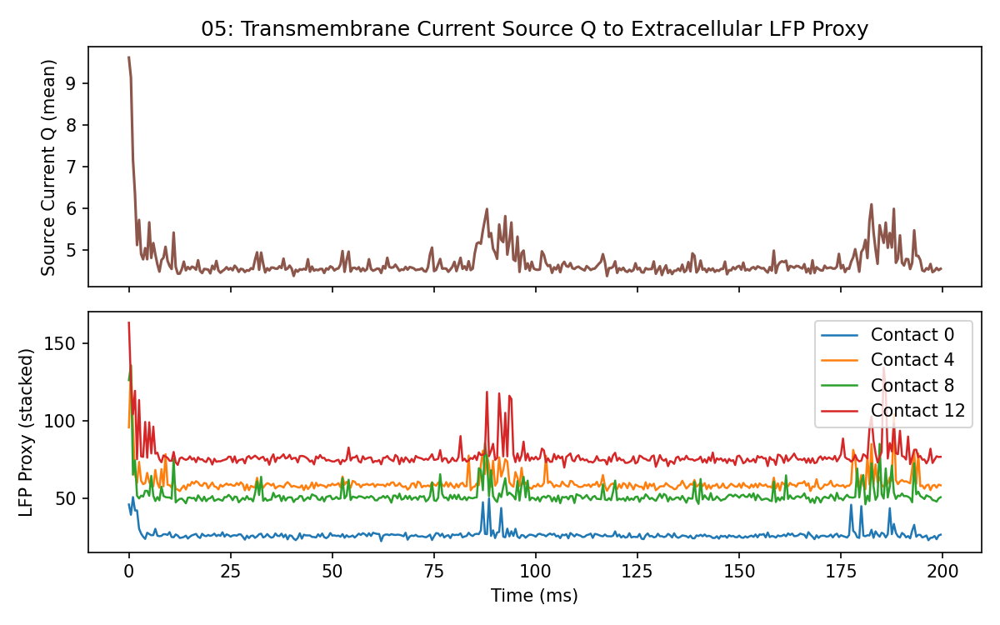
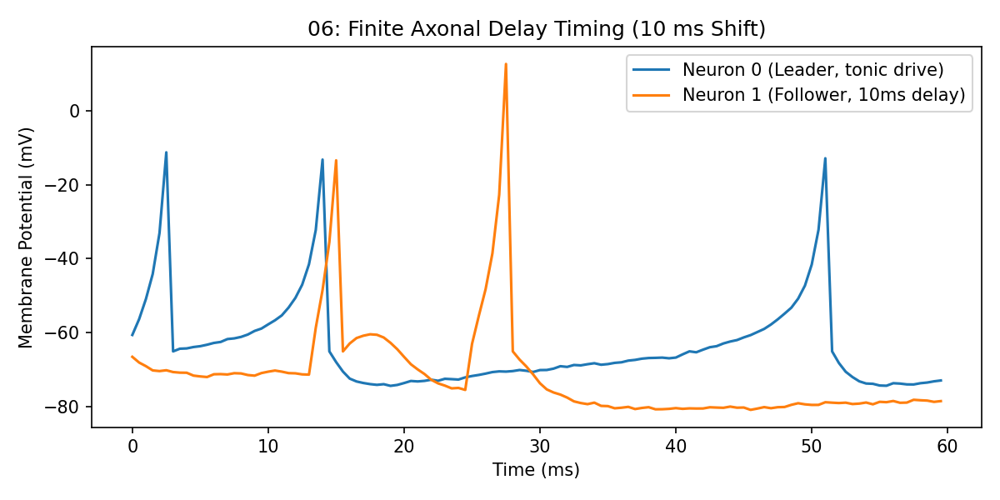
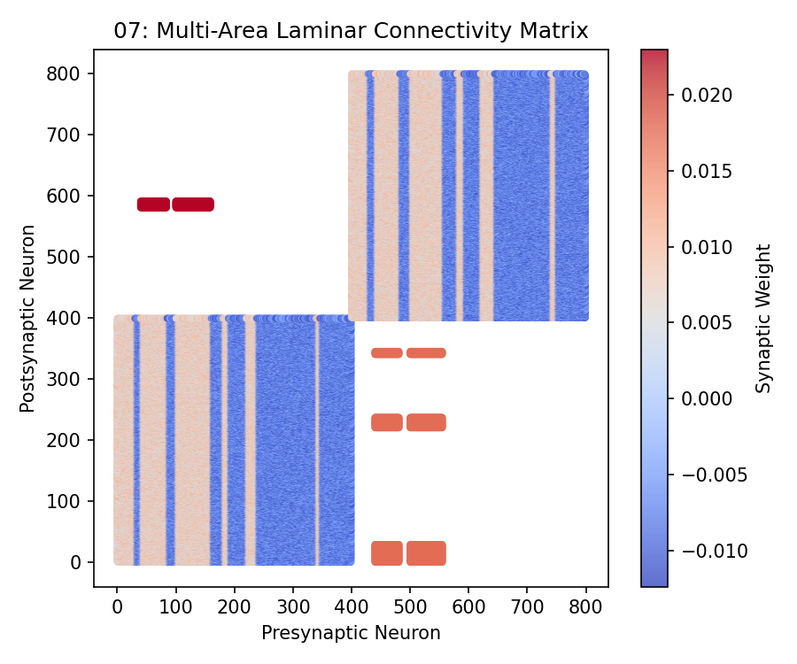
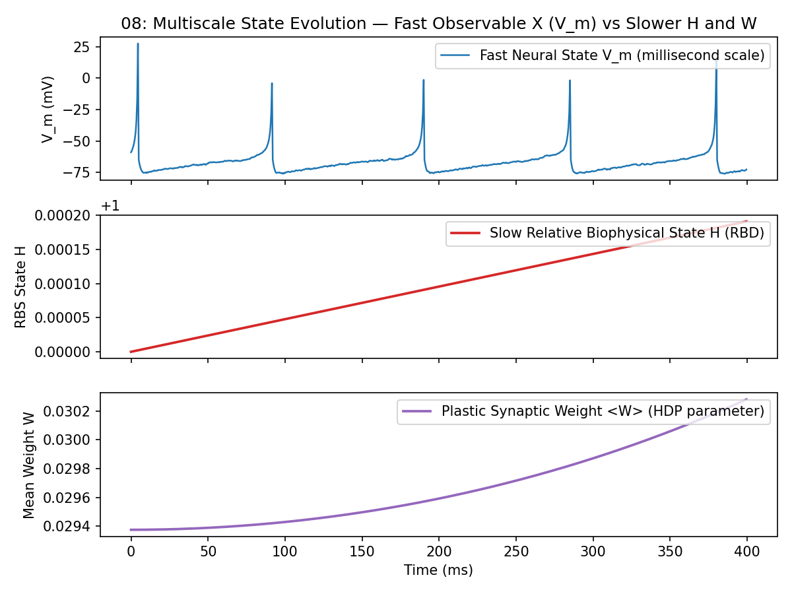
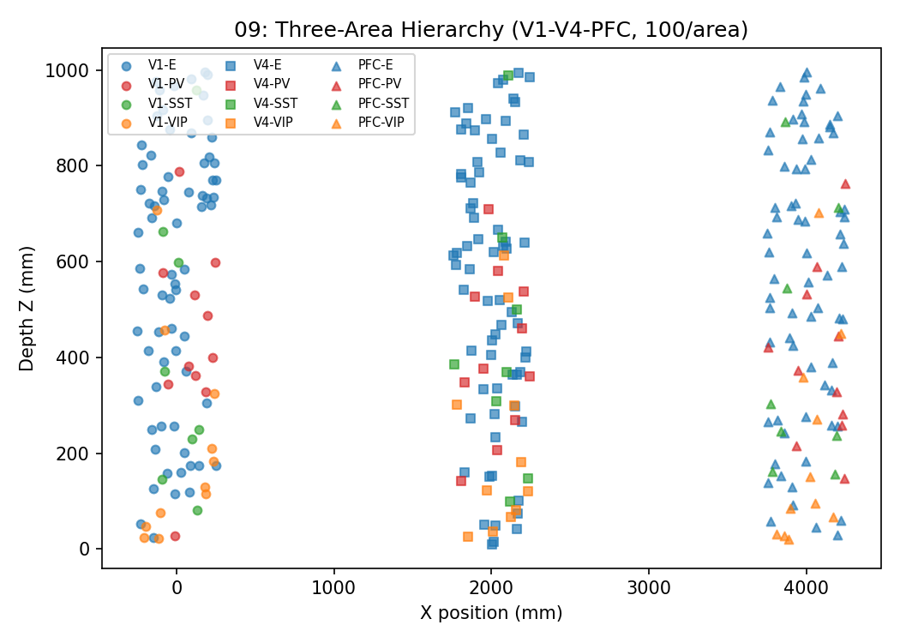

# Gallery

Nine reproducible reference panels generated entirely by repository code from JaxFNE.

All panels represent computational proxies and relative uncalibrated states (`calibration_status = relative_proxy_readout`). No direct physical or clinical claims are asserted.

---

## 01: Realized Network Structure



**Configuration:** `suite2_v1_v4_config` · **Seed:** `42`  
**Status:** `relative_proxy_coordinates`  
**Description:** Realized spatial locations and cell-class identities in a two-area (V1-V4) laminar network.

---

## 02: Population Activity and Spike Raster



**Configuration:** `suite2_net1_config(n=100)` · **Seed:** `10`  
**Status:** `uncalibrated_computational_scaffold`  
**Description:** Spike raster and instantaneous population firing rate for a recurrent 100-neuron network.

---

## 03: Fast Neural State Trajectories ($V_m$)



**Configuration:** `suite2_net1_config(n=100)` · **Seed:** `10`  
**Status:** `native_izhikevich_millivolts`  
**Description:** Membrane potential traces demonstrating fast spiking dynamics and subthreshold integration.

---

## 04: Relative Biophysical State (RBD Dynamics)



**Configuration:** `suite2_net1_config (enable_hdp=True)` · **Seed:** `7`  
**Status:** `relative_dimensionless_state`  
**Description:** Dynamic evolution of the Relative Biophysical State $H$ under activity-dependent drain and restorative control.

---

## 05: Transmembrane Current Source $Q$ to Extracellular LFP Proxy



**Configuration:** `suite2_net1_config (record_fields=True)` · **Seed:** `10`  
**Status:** `uncalibrated_source_and_field_proxy`  
**Description:** Transmembrane relative source proxy and projected laminar field potential (LFP) proxy across linear contacts.

---

## 06: Finite-Delay Timing — Event, Axonal Latency, and Postsynaptic Response



**Configuration:** `two_neuron_delay_circuit(delay=10ms)` · **Seed:** `1`  
**Status:** `discrete_delay_buffer_exact`  
**Description:** Explicit temporal decomposition: presynaptic spike emission, 10 ms axonal transmission buffer latency, arriving synaptic current, and subsequent postsynaptic EPSP integration.

---

## 07: Multi-Area Laminar Connectivity Matrix



**Configuration:** `suite2_v1_v4_config` · **Seed:** `42`  
**Status:** `uncalibrated_sparse_weights`  
**Description:** Realized sparse inter-column and intra-column synaptic connection matrix for V1-V4 multi-area model.

---

## 08: Multiscale State Evolution — Fast Observable $X$ ($V_m$) vs Slower $H$ and $W$



**Configuration:** `suite2_net1_config(n=100, enable_hdp=True)` · **Seed:** `7`  
**Status:** `multiscale_state_coupling`  
**Description:** Co-registered multiscale trajectories: sub-millisecond membrane state $X$ ($V_m$) alongside slower hidden biophysical state $H$ (RBD dynamics) and plastic synaptic weight coupling $W$ (HDP).

---

## 09: Three-Area Hierarchy (V1–V4–PFC)



**Configuration:** `build_multi_area_columns(["V1", "V4", "PFC"], n_per_area=100, ei_profile="canonical")` · **Seed:** `0`  
**Status:** `relative_proxy_coordinates`  
**Description:** Realized spatial locations and cell-class identities in a three-area laminar hierarchy with bidirectional feedforward/feedback connectivity.

Seven fixed panels, always emitted (`schema`, `network_3d`, `raster` as **OBSERVED**; `lfp`, `h_dynamics`, `hdp`, `oscillatory` as **DERIVED**), each carrying a provenance card (`config_hash`, N, edges, steps, dt, jaxfne version). A panel whose declared inputs cannot be met renders an explicit omission card, never a substitute:

- [Index Dashboard (`index.html`)](_static/atlas_three_area/index.html)
- [Panel 1: Circuit Schematic (`schema.html`)](_static/atlas_three_area/schema.html)
- [Panel 2: Network 3D (`network_3d.html`)](_static/atlas_three_area/network_3d.html)
- [Panel 3: Spike Raster (`raster.html`)](_static/atlas_three_area/raster.html)
- [Panel 4: LFP Proxy (`lfp.html`)](_static/atlas_three_area/lfp.html)
- [Panel 5: H Dynamics (`h_dynamics.html`)](_static/atlas_three_area/h_dynamics.html)
- [Panel 6: HDP Plasticity (`hdp.html`)](_static/atlas_three_area/hdp.html)
- [Panel 7: Oscillatory Response (`oscillatory.html`)](_static/atlas_three_area/oscillatory.html)

```python
import jaxfne as jtfne
from jaxfne.vis import build_atlas

cfg = (
    jtfne.build_multi_area_columns(["V1", "V4", "PFC"], n_per_area=100, ei_profile="canonical")
    .runtime(seed=0)
    .set_emitter("izhikevich", "cortical_eig")
    .probes(["spikes", "V_m"])
    .field(domain="laminar_column", conductivity="proxy")
)
model = jtfne.construct(cfg)
sim = jtfne.simulation(duration_ms=500.0, dt_ms=0.5, seed=0)
signals = jtfne.simulate(model, sim)
manifest = build_atlas(
    model, signals,
    out_dir="docs/_static/atlas_three_area",
    title="V1-V4-PFC three-area hierarchy (100/area)",
)
```

## Atlas evidence index (generated)

<!-- ATLAS-INDEX:START -->

Evidence index of validated atlases (25 models). Generated from committed `manifest.json` files — do not edit by hand; run `python scripts/generate_gallery.py --write`.

### `atlas/calibration_100` — Calibration-ready column, minimal run (100n, 200 ms)

State `validated` · N=100 · edges=9900 · steps=400 · config `89c984072818` · jaxfne 0.4.24

[Index](_static/atlas/calibration_100/index.html) · [Circuit schematic](_static/atlas/calibration_100/schema.html) · [Network 3D](_static/atlas/calibration_100/network_3d.html) · [Spike raster](_static/atlas/calibration_100/raster.html) · [LFP proxy](_static/atlas/calibration_100/lfp.html) · [H dynamics](_static/atlas/calibration_100/h_dynamics.html) · [HDP plasticity](_static/atlas/calibration_100/hdp.html) · [Oscillatory response](_static/atlas/calibration_100/oscillatory.html)

### `atlas/canonical_etude_1000` — Canonical-column etude, uniform drive (1000n)

State `validated` · N=1000 · edges=999000 · steps=2000 · config `b8ec3bc1536d` · jaxfne 0.4.24

[Index](_static/atlas/canonical_etude_1000/index.html) · [Circuit schematic](_static/atlas/canonical_etude_1000/schema.html) · [Network 3D](_static/atlas/canonical_etude_1000/network_3d.html) · [Spike raster](_static/atlas/canonical_etude_1000/raster.html) · [LFP proxy](_static/atlas/canonical_etude_1000/lfp.html) · [H dynamics](_static/atlas/canonical_etude_1000/h_dynamics.html) · [HDP plasticity](_static/atlas/canonical_etude_1000/hdp.html) · [Oscillatory response](_static/atlas/canonical_etude_1000/oscillatory.html)

### `atlas/config_grammar_1000` — Configuration-grammar column, smoke-scale (1000n, 200 ms)

State `validated` · N=1000 · edges=999000 · steps=400 · config `4665fb608374` · jaxfne 0.4.24

[Index](_static/atlas/config_grammar_1000/index.html) · [Circuit schematic](_static/atlas/config_grammar_1000/schema.html) · [Network 3D](_static/atlas/config_grammar_1000/network_3d.html) · [Spike raster](_static/atlas/config_grammar_1000/raster.html) · [LFP proxy](_static/atlas/config_grammar_1000/lfp.html) · [H dynamics](_static/atlas/config_grammar_1000/h_dynamics.html) · [HDP plasticity](_static/atlas/config_grammar_1000/hdp.html) · [Oscillatory response](_static/atlas/config_grammar_1000/oscillatory.html)

### `atlas/ei_population_100` — Chainable E/I population (100n)

State `validated` · N=100 · edges=9900 · steps=2000 · config `8c242da2a84d` · jaxfne 0.4.24

[Index](_static/atlas/ei_population_100/index.html) · [Circuit schematic](_static/atlas/ei_population_100/schema.html) · [Network 3D](_static/atlas/ei_population_100/network_3d.html) · [Spike raster](_static/atlas/ei_population_100/raster.html) · [LFP proxy](_static/atlas/ei_population_100/lfp.html) · [H dynamics](_static/atlas/ei_population_100/h_dynamics.html) · [HDP plasticity](_static/atlas/ei_population_100/hdp.html) · [Oscillatory response](_static/atlas/ei_population_100/oscillatory.html)

### `atlas/evoked_l4` — Evoked L4 drive, evoked condition (100n)

State `validated` · N=100 · edges=9900 · steps=3000 · config `7e7787b1d51a` · jaxfne 0.4.24

[Index](_static/atlas/evoked_l4/index.html) · [Circuit schematic](_static/atlas/evoked_l4/schema.html) · [Network 3D](_static/atlas/evoked_l4/network_3d.html) · [Spike raster](_static/atlas/evoked_l4/raster.html) · [LFP proxy](_static/atlas/evoked_l4/lfp.html) · [H dynamics](_static/atlas/evoked_l4/h_dynamics.html) · [HDP plasticity](_static/atlas/evoked_l4/hdp.html) · [Oscillatory response](_static/atlas/evoked_l4/oscillatory.html)

### `atlas/hdp_10` — HDP circuit, full recording (10n, 100 ms)

State `validated` · N=10 · edges=90 · steps=200 · config `ab7094aaea2a` · jaxfne 0.4.24

[Index](_static/atlas/hdp_10/index.html) · [Circuit schematic](_static/atlas/hdp_10/schema.html) · [Network 3D](_static/atlas/hdp_10/network_3d.html) · [Spike raster](_static/atlas/hdp_10/raster.html) · [LFP proxy](_static/atlas/hdp_10/lfp.html) · [H dynamics](_static/atlas/hdp_10/h_dynamics.html) · [HDP plasticity](_static/atlas/hdp_10/hdp.html) · [Oscillatory response](_static/atlas/hdp_10/oscillatory.html)

### `atlas/hdp_1000` — HDP column, short run (1000n, 200 ms)

State `validated` · N=1000 · edges=999000 · steps=400 · config `95bf84df66d3` · jaxfne 0.4.24

[Index](_static/atlas/hdp_1000/index.html) · [Circuit schematic](_static/atlas/hdp_1000/schema.html) · [Network 3D](_static/atlas/hdp_1000/network_3d.html) · [Spike raster](_static/atlas/hdp_1000/raster.html) · [LFP proxy](_static/atlas/hdp_1000/lfp.html) · [H dynamics](_static/atlas/hdp_1000/h_dynamics.html) · [HDP plasticity](_static/atlas/hdp_1000/hdp.html) · [Oscillatory response](_static/atlas/hdp_1000/oscillatory.html)

### `atlas/homeostasis_1000` — Homeostasis column (1000n)

State `validated` · N=1000 · edges=999000 · steps=2000 · config `bcb3203f32e2` · jaxfne 0.4.24

[Index](_static/atlas/homeostasis_1000/index.html) · [Circuit schematic](_static/atlas/homeostasis_1000/schema.html) · [Network 3D](_static/atlas/homeostasis_1000/network_3d.html) · [Spike raster](_static/atlas/homeostasis_1000/raster.html) · [LFP proxy](_static/atlas/homeostasis_1000/lfp.html) · [H dynamics](_static/atlas/homeostasis_1000/h_dynamics.html) · [HDP plasticity](_static/atlas/homeostasis_1000/hdp.html) · [Oscillatory response](_static/atlas/homeostasis_1000/oscillatory.html)

### `atlas/lfp_csd_12` — LFP/CSD laminar column (12n)

State `validated` · N=12 · edges=132 · steps=2000 · config `a07c380b8304` · jaxfne 0.4.24

[Index](_static/atlas/lfp_csd_12/index.html) · [Circuit schematic](_static/atlas/lfp_csd_12/schema.html) · [Network 3D](_static/atlas/lfp_csd_12/network_3d.html) · [Spike raster](_static/atlas/lfp_csd_12/raster.html) · [LFP proxy](_static/atlas/lfp_csd_12/lfp.html) · [H dynamics](_static/atlas/lfp_csd_12/h_dynamics.html) · [HDP plasticity](_static/atlas/lfp_csd_12/hdp.html) · [Oscillatory response](_static/atlas/lfp_csd_12/oscillatory.html)

### `atlas` — Canonical V1 Column (1000n)

State `validated` · N=1000 · edges=215785 · steps=2000 · config `e70109809281` · jaxfne 0.4.24

[Index](_static/atlas/index.html) · [Circuit schematic](_static/atlas/schema.html) · [Network 3D](_static/atlas/network_3d.html) · [Spike raster](_static/atlas/raster.html) · [LFP proxy](_static/atlas/lfp.html) · [H dynamics](_static/atlas/h_dynamics.html) · [HDP plasticity](_static/atlas/hdp.html) · [Oscillatory response](_static/atlas/oscillatory.html)

### `atlas/network_100_ei` — Balanced E/I population (100n)

State `validated` · N=100 · edges=9900 · steps=1000 · config `e58d76183666` · jaxfne 0.4.24

[Index](_static/atlas/network_100_ei/index.html) · [Circuit schematic](_static/atlas/network_100_ei/schema.html) · [Network 3D](_static/atlas/network_100_ei/network_3d.html) · [Spike raster](_static/atlas/network_100_ei/raster.html) · [LFP proxy](_static/atlas/network_100_ei/lfp.html) · [H dynamics](_static/atlas/network_100_ei/h_dynamics.html) · [HDP plasticity](_static/atlas/network_100_ei/hdp.html) · [Oscillatory response](_static/atlas/network_100_ei/oscillatory.html)

### `atlas/objective_60` — Objective-grammar chain, pre-tune (60n)

State `validated` · N=60 · edges=3540 · steps=400 · config `48f956974352` · jaxfne 0.4.24

[Index](_static/atlas/objective_60/index.html) · [Circuit schematic](_static/atlas/objective_60/schema.html) · [Network 3D](_static/atlas/objective_60/network_3d.html) · [Spike raster](_static/atlas/objective_60/raster.html) · [LFP proxy](_static/atlas/objective_60/lfp.html) · [H dynamics](_static/atlas/objective_60/h_dynamics.html) · [HDP plasticity](_static/atlas/objective_60/hdp.html) · [Oscillatory response](_static/atlas/objective_60/oscillatory.html)

### `atlas/omission_60` — Omission-oddball column, plain drive (60n)

State `validated` · N=60 · edges=3540 · steps=2000 · config `019bbe488cf5` · jaxfne 0.4.24

[Index](_static/atlas/omission_60/index.html) · [Circuit schematic](_static/atlas/omission_60/schema.html) · [Network 3D](_static/atlas/omission_60/network_3d.html) · [Spike raster](_static/atlas/omission_60/raster.html) · [LFP proxy](_static/atlas/omission_60/lfp.html) · [H dynamics](_static/atlas/omission_60/h_dynamics.html) · [HDP plasticity](_static/atlas/omission_60/hdp.html) · [Oscillatory response](_static/atlas/omission_60/oscillatory.html)

### `atlas/operator_chain_40` — Operator-composition column (40n)

State `validated` · N=40 · edges=1560 · steps=200 · config `d22bc040c652` · jaxfne 0.4.24

[Index](_static/atlas/operator_chain_40/index.html) · [Circuit schematic](_static/atlas/operator_chain_40/schema.html) · [Network 3D](_static/atlas/operator_chain_40/network_3d.html) · [Spike raster](_static/atlas/operator_chain_40/raster.html) · [LFP proxy](_static/atlas/operator_chain_40/lfp.html) · [H dynamics](_static/atlas/operator_chain_40/h_dynamics.html) · [HDP plasticity](_static/atlas/operator_chain_40/hdp.html) · [Oscillatory response](_static/atlas/operator_chain_40/oscillatory.html)

### `atlas/probe_32` — Probe-operators circuit, minimal run (32n, 200 ms)

State `validated` · N=32 · edges=992 · steps=400 · config `5690a65f088b` · jaxfne 0.4.24

[Index](_static/atlas/probe_32/index.html) · [Circuit schematic](_static/atlas/probe_32/schema.html) · [Network 3D](_static/atlas/probe_32/network_3d.html) · [Spike raster](_static/atlas/probe_32/raster.html) · [LFP proxy](_static/atlas/probe_32/lfp.html) · [H dynamics](_static/atlas/probe_32/h_dynamics.html) · [HDP plasticity](_static/atlas/probe_32/hdp.html) · [Oscillatory response](_static/atlas/probe_32/oscillatory.html)

### `atlas/scale_100` — Suite No. 3 scale N=100 (async patch)

State `validated` · N=100 · edges=9900 · steps=2000 · config `96a6c894ecad` · jaxfne 0.4.24

[Index](_static/atlas/scale_100/index.html) · [Circuit schematic](_static/atlas/scale_100/schema.html) · [Network 3D](_static/atlas/scale_100/network_3d.html) · [Spike raster](_static/atlas/scale_100/raster.html) · [LFP proxy](_static/atlas/scale_100/lfp.html) · [H dynamics](_static/atlas/scale_100/h_dynamics.html) · [HDP plasticity](_static/atlas/scale_100/hdp.html) · [Oscillatory response](_static/atlas/scale_100/oscillatory.html)

### `atlas/single_neuron` — Single neuron (1n)

State `validated` · N=1 · edges=0 · steps=1000 · config `3cb76d611297` · jaxfne 0.4.24

[Index](_static/atlas/single_neuron/index.html) · [Circuit schematic](_static/atlas/single_neuron/schema.html) · [Network 3D](_static/atlas/single_neuron/network_3d.html) · [Spike raster](_static/atlas/single_neuron/raster.html) · [LFP proxy](_static/atlas/single_neuron/lfp.html) · [H dynamics](_static/atlas/single_neuron/h_dynamics.html) · [HDP plasticity](_static/atlas/single_neuron/hdp.html) · [Oscillatory response](_static/atlas/single_neuron/oscillatory.html)

### `atlas/source_column_48` — Source-bookkeeping column (48n)

State `validated` · N=48 · edges=2256 · steps=2000 · config `e29a9e61e9eb` · jaxfne 0.4.24

[Index](_static/atlas/source_column_48/index.html) · [Circuit schematic](_static/atlas/source_column_48/schema.html) · [Network 3D](_static/atlas/source_column_48/network_3d.html) · [Spike raster](_static/atlas/source_column_48/raster.html) · [LFP proxy](_static/atlas/source_column_48/lfp.html) · [H dynamics](_static/atlas/source_column_48/h_dynamics.html) · [HDP plasticity](_static/atlas/source_column_48/hdp.html) · [Oscillatory response](_static/atlas/source_column_48/oscillatory.html)

### `atlas/suite1_column` — Suite No. 1 laminar column, smoke-scale (48n, 1000 ms of 5000 ms)

State `validated` · N=48 · edges=2256 · steps=2000 · config `316023c3edc9` · jaxfne 0.4.24

[Index](_static/atlas/suite1_column/index.html) · [Circuit schematic](_static/atlas/suite1_column/schema.html) · [Network 3D](_static/atlas/suite1_column/network_3d.html) · [Spike raster](_static/atlas/suite1_column/raster.html) · [LFP proxy](_static/atlas/suite1_column/lfp.html) · [H dynamics](_static/atlas/suite1_column/h_dynamics.html) · [HDP plasticity](_static/atlas/suite1_column/hdp.html) · [Oscillatory response](_static/atlas/suite1_column/oscillatory.html)

### `atlas/suite2_net1` — Suite No. 2 net1 (100n)

State `validated` · N=100 · edges=9900 · steps=2000 · config `77ffbae9ae3e` · jaxfne 0.4.24

[Index](_static/atlas/suite2_net1/index.html) · [Circuit schematic](_static/atlas/suite2_net1/schema.html) · [Network 3D](_static/atlas/suite2_net1/network_3d.html) · [Spike raster](_static/atlas/suite2_net1/raster.html) · [LFP proxy](_static/atlas/suite2_net1/lfp.html) · [H dynamics](_static/atlas/suite2_net1/h_dynamics.html) · [HDP plasticity](_static/atlas/suite2_net1/hdp.html) · [Oscillatory response](_static/atlas/suite2_net1/oscillatory.html)

### `atlas/two_neuron_ei` — Two-neuron E/I (2n)

State `validated` · N=2 · edges=2 · steps=1000 · config `9754eb5d015a` · jaxfne 0.4.24

[Index](_static/atlas/two_neuron_ei/index.html) · [Circuit schematic](_static/atlas/two_neuron_ei/schema.html) · [Network 3D](_static/atlas/two_neuron_ei/network_3d.html) · [Spike raster](_static/atlas/two_neuron_ei/raster.html) · [LFP proxy](_static/atlas/two_neuron_ei/lfp.html) · [H dynamics](_static/atlas/two_neuron_ei/h_dynamics.html) · [HDP plasticity](_static/atlas/two_neuron_ei/hdp.html) · [Oscillatory response](_static/atlas/two_neuron_ei/oscillatory.html)

### `atlas/v1_column` — V1 six-layer column (600n)

State `validated` · N=600 · edges=359400 · steps=2000 · config `c67fe0dfb71c` · jaxfne 0.4.24

[Index](_static/atlas/v1_column/index.html) · [Circuit schematic](_static/atlas/v1_column/schema.html) · [Network 3D](_static/atlas/v1_column/network_3d.html) · [Spike raster](_static/atlas/v1_column/raster.html) · [LFP proxy](_static/atlas/v1_column/lfp.html) · [H dynamics](_static/atlas/v1_column/h_dynamics.html) · [HDP plasticity](_static/atlas/v1_column/hdp.html) · [Oscillatory response](_static/atlas/v1_column/oscillatory.html)

### `atlas/v1_pfc_dual` — V1-PFC dual column, single AAAB trial (200n, no HDP carryover)

State `validated` · N=200 · edges=240 · steps=2000 · config `9340ca271b11` · jaxfne 0.4.24

[Index](_static/atlas/v1_pfc_dual/index.html) · [Circuit schematic](_static/atlas/v1_pfc_dual/schema.html) · [Network 3D](_static/atlas/v1_pfc_dual/network_3d.html) · [Spike raster](_static/atlas/v1_pfc_dual/raster.html) · [LFP proxy](_static/atlas/v1_pfc_dual/lfp.html) · [H dynamics](_static/atlas/v1_pfc_dual/h_dynamics.html) · [HDP plasticity](_static/atlas/v1_pfc_dual/hdp.html) · [Oscillatory response](_static/atlas/v1_pfc_dual/oscillatory.html)

### `atlas/v1v4_80` — V1-V4 scaffold (80/area)

State `validated` · N=160 · edges=12891 · steps=2000 · config `e2ea9eebdc98` · jaxfne 0.4.24

[Index](_static/atlas/v1v4_80/index.html) · [Circuit schematic](_static/atlas/v1v4_80/schema.html) · [Network 3D](_static/atlas/v1v4_80/network_3d.html) · [Spike raster](_static/atlas/v1v4_80/raster.html) · [LFP proxy](_static/atlas/v1v4_80/lfp.html) · [H dynamics](_static/atlas/v1v4_80/h_dynamics.html) · [HDP plasticity](_static/atlas/v1v4_80/hdp.html) · [Oscillatory response](_static/atlas/v1v4_80/oscillatory.html)

### `atlas_three_area` — V1-V4-PFC three-area hierarchy (100/area)

State `validated` · N=300 · edges=30105 · steps=1000 · config `84f67ccf815f` · jaxfne 0.4.24

[Index](_static/atlas_three_area/index.html) · [Circuit schematic](_static/atlas_three_area/schema.html) · [Network 3D](_static/atlas_three_area/network_3d.html) · [Spike raster](_static/atlas_three_area/raster.html) · [LFP proxy](_static/atlas_three_area/lfp.html) · [H dynamics](_static/atlas_three_area/h_dynamics.html) · [HDP plasticity](_static/atlas_three_area/hdp.html) · [Oscillatory response](_static/atlas_three_area/oscillatory.html)

<!-- ATLAS-INDEX:END -->

