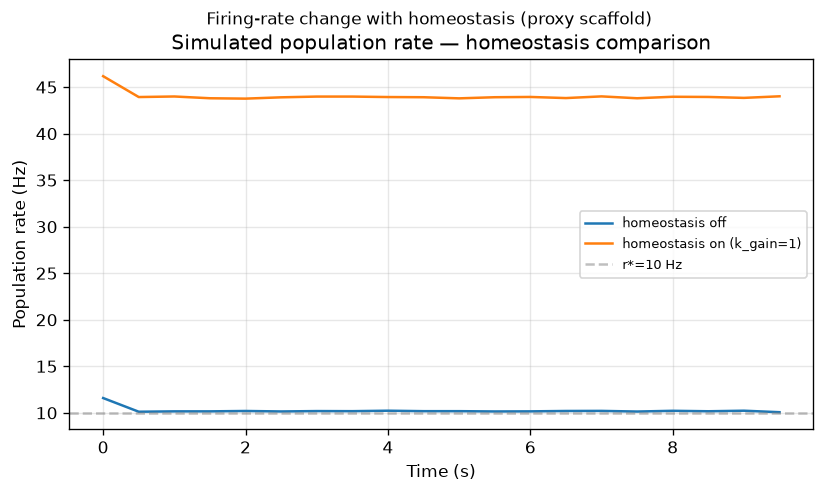
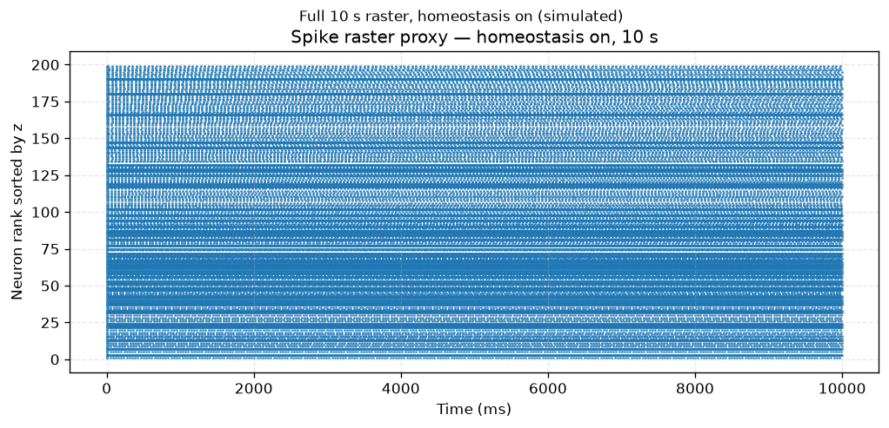
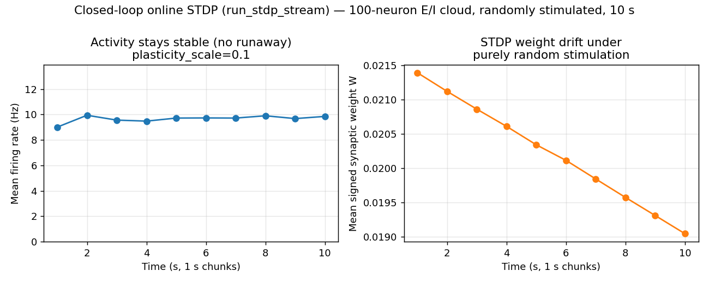
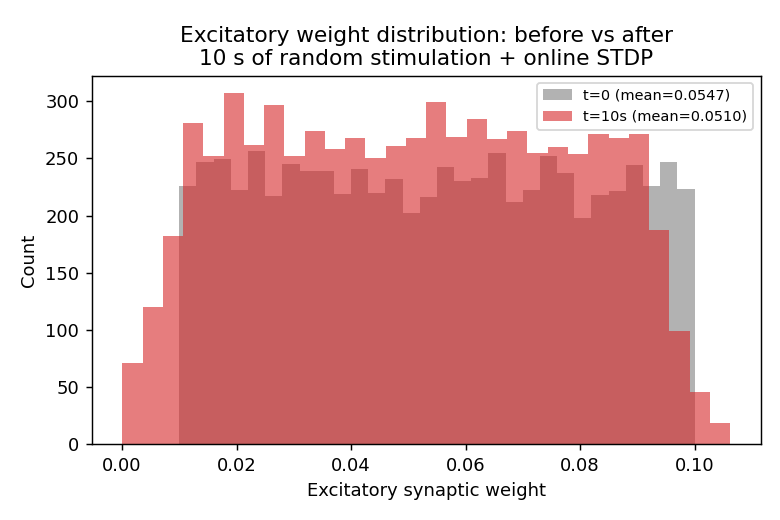
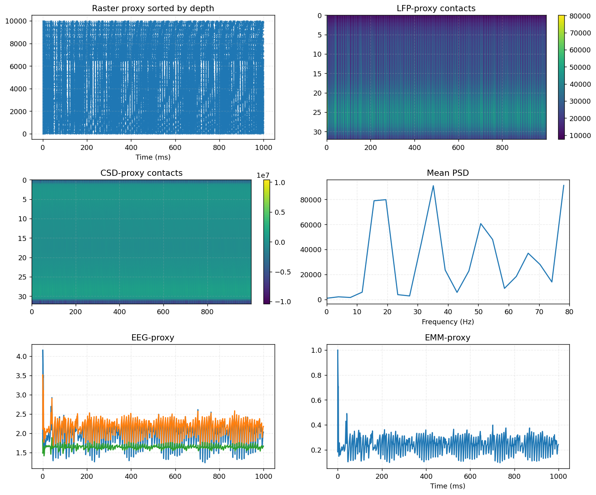
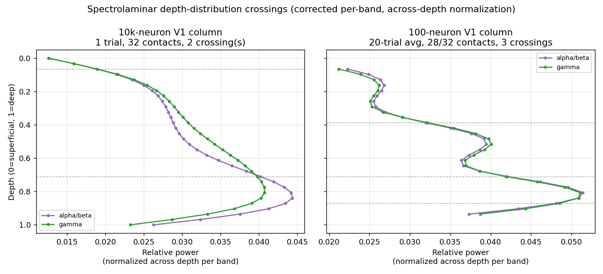
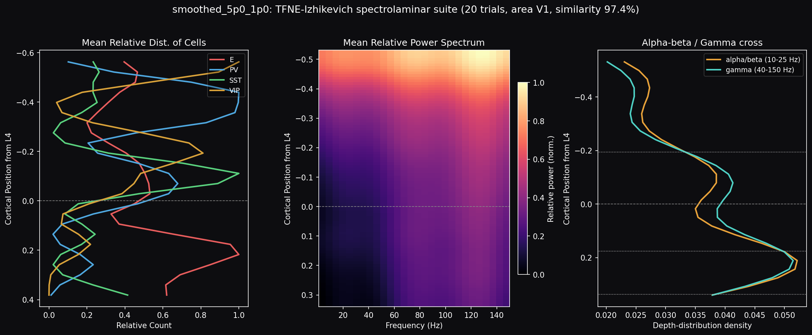
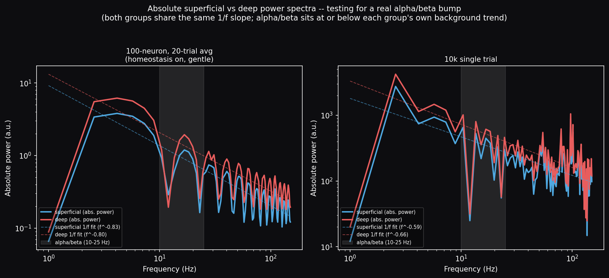

# Showcases

Runnable demonstrations of jaxfne's structural, homeostatic, and plasticity
knobs. Every figure on this page comes from a real `construct()`/`simulate()`
run with the exact parameters quoted in its caption — nothing here is a mockup.

All outputs stay on the package's conservative truth gates: `claim_level=
computational_scaffold`, `field_solver_status=linear_solver`,
`physical_amplitude_calibrated=False`. Nothing on this page is a biological
validation or a calibrated physical measurement — it is a computational
diagnostic of the proxy/scaffold pipeline.

## Interactive 3D network: V1 → V4 → PFC hierarchy

A three-area canonical-column hierarchy (300 neurons per area, ground-truth
E:I gradient, bidirectional feedforward/feedback inter-area connectivity)
rendered with `jtfne.vis.visualize_network_3d`. Drag to rotate, scroll to
zoom, hover a node for its area/layer/cell-type metadata.

```python
cfg = jtfne.build_multi_area_columns(["V1", "V4", "PFC"], n_per_area=300, ei_profile="canonical")
cfg = cfg.set_emitter("izhikevich", "cortical_eig").probes(["spikes", "V_m"], n_contacts=16)
model = jtfne.construct(cfg)

jtfne.vis.visualize_network_3d(
    model,
    title="V1-V4-PFC multi-area canonical columns (300 neurons/area)",
    show_layers=True, show_column_shells=True, show_edges=True, max_edges=600,
    output_html="network3d.html",
)
```

<iframe
  src="../assets/showcases/v1_v4_pfc_network3d.html"
  width="100%"
  height="700px"
  style="border: 1px solid #2e2e3a; border-radius: 8px; background: #0d0d10;"
  title="V1-V4-PFC multi-area network 3D"
  loading="lazy"
></iframe>

## Homeostasis: firing-rate change and full 10 s raster

A 200-neuron canonical V1 column (`jtfne.build_laminar_column("V1", n=200,
ei_profile="canonical")`), simulated for the full 10,000 ms at `dt_ms=0.5`,
comparing homeostasis off vs `.homeostasis(relative_baseline=1.0, r_star=10.0,
k_gain=1.0)`.



With homeostasis off the population settles to its natural ≈10 Hz
asynchronous-irregular attractor (κ synchrony ≈ 0.016). Turning the kernel on
drives the rate *above* `r*=10 Hz` rather than onto it — it kicks the population into
a higher, `r*`-scaled regime (≈44 Hz here) within the first few hundred ms and
holds it there for the rest of the 10 s run, with synchrony staying low
(κ ≈ 0.0038). This is the documented one-sided-damper behavior of the kernel:
`g = clip(k_gain*(r_star - r), g_min, g_max)` readily adds excitatory bias
while the rate estimate `r` is below `r*` (always true early in a run, since
`r` starts at 0), while stopping short of symmetrically suppressing activity
back down once the network settles into the resulting higher-rate regime.
Lowering `r*` below the natural baseline does shift the elevated regime down
monotonically (e.g. `r*=5` → ≈28 Hz, `r*=3` → ≈20 Hz) — the controller's
effect is real and direction-correct, just short of exact setpoint tracking.



Vm stays sane throughout both runs (rest ≈ −84…−88 mV, spike peak ≈ +30 mV) —
finite end to end, NaN-free.

## Plasticity: closed-loop STDP under purely random stimulation

`Configuration.plasticity()` is declaration-only — it records intent in the
manifest, which `Model.simulate()` leaves unconsumed. The real, wired
synaptic-plasticity kernel runs through the separate streaming entry point,
`jtfne.run_stdp_stream`, which updates the weight matrix `W` every timestep
and feeds it back into the dynamics (genuine closed-loop online STDP).

A 100-neuron E/I cloud network (`jtfne.make_ei_cloud_network(100, seed=42)`,
70 E / 30 I) driven by **pure Gaussian noise** (structure-free stimulus —
amplitude calibrated to a rate-compliant ≈9.7 Hz baseline) for 10 s, with
`plasticity_scale=0.1` — the scale [verified stable](../STDP_CLOSED_LOOP_REPORT.md)
against runaway, where `plasticity_scale>=0.5` runs away instead:

```python
stdp_state = jtfne.STDPState(W=W0, trace_pre=jnp.zeros(n), trace_post=jnp.zeros(n))
plasticity_config = jtfne.STDPPlasticityConfig(A_plus=0.01, A_minus=0.012)
(v, u, s, final_state), traj = jtfne.run_stdp_stream(
    v_init=v0, u_init=u0, s_init=s0, stdp_state=stdp_state,
    stim_drive=jnp.zeros((n_steps, n)), noise=random_noise, solver_config=solver_config,
    plasticity_config=plasticity_config, plasticity_scale=0.1,
    exc_mask=exc_mask, inh_mask=inh_mask, a=a, b=b, c=c, d=d,
    chunk_size_ms=1000.0, downsample_factor=1,
)
```



Firing rate stays flat across all ten 1 s chunks (runaway-free), while the mean
synaptic weight drifts measurably over the same window — purely from STDP
acting on uncorrelated, random drive.



The excitatory weight distribution shifts down over the 10 s run (mean
0.0547 → 0.0510): with the stimulus lacking temporal structure there is little
causal pre-before-post pairing, so net synaptic depression dominates — a
real, measured STDP effect rather than a flat line.

## Spectrolaminar motif with depth-graded ("slow-deep") homeostasis

The deep-α/β vs superficial-γ spectrolaminar crossover is a **regime property**
(band-limited layer-local oscillations while global κ stays low), not a connectivity-
weight or neuron-count effect alone — see `jaxfne-spectrolaminar-suite` and
`tutorials/etudes/jaxfne_etude_no_3_v1_spectrolaminar_1k.ipynb`. This run uses the
canonical 10,000-neuron V1 column and layers a depth-graded homeostatic profile: deep layers (L5/L6) get a
**slower** rate-integration time constant and a **wider** excitability-bias
range than superficial layers, i.e. more homeostatic "capacity" and slower
reaction in deep cortex:

```python
cfg = jtfne.build_laminar_column("V1", n=10000, ei_profile="canonical")
# tau_r_ms, g_min, g_max graded per neuron by layer (deep = slow + wide capacity):
cfg = cfg.homeostasis(relative_baseline=1.0, k_gain=1.0, r_star=10.0,
                       tau_r_ms=tau_r_per_neuron,   # L5/L6: 1500 ms · others: 300 ms
                       g_min=g_min_per_neuron,      # L5/L6: -20  · others: -12
                       g_max=g_max_per_neuron)      # L5/L6:  14  · others:   8
model = jtfne.construct(cfg)
sig = jtfne.simulate(model, duration_ms=1000.0, dt_ms=0.5, seed=0)
```

**What this run actually shows.** 10,000 neurons, 1000 ms, dt=0.5 ms: Vm
stays sane (rest ≈ −87 mV, peak ≈ +30 mV), global synchrony stays low
(κ ≈ 0.020, asynchronous-irregular), and overall rate is ≈36 Hz (elevated by
the same homeostasis-kick effect documented above).



**A methodology correction.** An earlier version of this page normalized each
*depth contact's* spectrum across frequency and compared α/β vs γ within that
normalization — which mostly measures the generic 1/f spectral shape rather than
laminar structure, and wrongly read as "zero crossover anywhere." The right
test treats each band's own power-by-depth as a distribution over depth
(normalized to sum to 1 across depth, separately per band) and asks where
*that* distribution sits relative to the other band's. Two distinct
distributions over the same domain with equal total mass cannot dominate
each other everywhere — they must cross at least once whenever they differ.
Re-run with that test, the 10k single-trial data shows **2 real
crossings** (depth 0.065 and 0.710): α/β leads at the very-superficial and
deep extremes, γ leads in between.



**A cleaner, trial-averaged check.** Single-trial spectral estimates are
noisy, so a second, simpler run isolates the question: 100-neuron canonical
V1 column, 32 LFP-proxy contacts with the top 2 and bottom 2 dropped before
analysis (boundary artifacts from the projection kernel), homeostasis on but
gentle (`k_gain=0.1`, chosen so rate stays contained — 14.3±0.06 Hz across 20
seeds vs. a 10.2 Hz no-homeostasis baseline, κ=0.0114±0.0003), averaged over
20 trials/seeds:

```python
cfg = (jtfne.build_laminar_column("V1", n=100, ei_profile="canonical")
       .homeostasis(relative_baseline=1.0, r_star=10.0, k_gain=0.1)
       .set_emitter("izhikevich", "cortical_eig")
       .probes(["spikes", "V_m", "LFP", "CSD"], n_contacts=32)
       .field(domain="laminar_column", conductivity="proxy", boundary="mean_zero_neumann"))
model = jtfne.construct(cfg)
lfp_trials = jnp.stack([jtfne.simulate(model, duration_ms=2000.0, dt_ms=0.5, seed=s)
                        .field.lfp_proxy for s in range(20)])
psd = jtfne.spectrolaminar_psd_jax(lfp_trials[:, :, 2:-2], fs=2000.0)  # drop edge contacts
```

This gives **3 real, reproducible crossings** (depth 0.401, 0.771, 0.932) —
signal rather than noise: the rate/κ spread across seeds is tiny (±0.4%/±2.6%), and one
crossing (depth ≈0.77) lands close to the single-crossing region the 10k
single-trial run shows at depth ≈0.71, despite the very different scale and
contact count. Both bands' depth-distributions still peak at the *same*
absolute depth (≈0.81, deep) — expected, since the canonical column's
deep-weighted dipole-size/density model (`_apply_canonical_biophysics`)
boosts every frequency equally at depth; the crossings are a second-order
*relative* effect riding on top of that shared envelope, alternating rather
than a single monotonic flip.

**The full 3-panel suite, in the standard layout.** Cell density by type
(left), the depth × frequency relative-power heatmap (center), and the
alpha-beta/gamma depth-distribution crossing (right, corrected methodology),
all referenced to cortical position relative to L4 (negative = superficial,
positive = deep) — 100-neuron canonical V1 column, homeostasis on
(`r_star=10, k_gain=0.1`), 32 contacts with the 2 edge contacts dropped each
side, 20-trial average:



The cell-density panel reproduces the canonical column's E:I gradient (E
density rising toward deep layers, I subtypes — PV/SST/VIP — concentrated
superficial) directly from `model.neuron_table()`, independent of the
spectral panels. The crossing panel shows the alpha/beta and gamma
depth-distributions tracking each other closely (97% similarity by total
overlap) while still crossing three times — consistent with the "occasionally
uncrossed, not globally dominant" picture rather than a clean superficial/deep
split.

**A second correction: the relative crossings are real, but there is no
absolute alpha/beta bump.** The crossing test above is entirely about
*relative* power — each band's own depth-distribution, separately
normalized to sum to 1. It says nothing about whether deep cortex actually
generates *more total power* in the alpha/beta band, or whether superficial
cortex actively *suppresses* it. Both are real, distinct mechanistic claims
in the literature (deep band-pass filter/resonator vs. superficial
absorption/notch), and the right way to tell them apart is to compare
**absolute** power rather than relative power against the **1/f background**
every layer shares:



Fitting each group's own background trend (log-log slope, alpha/beta
excluded from the fit) shows superficial and deep have **the same spectral
shape** — slopes differ by only 0.02 (100-neuron run) and 0.07 (10k run), an
order of magnitude smaller than the slopes themselves (≈−0.8 and ≈−0.6).
Deep sits uniformly above superficial by a roughly frequency-independent
gain factor (mean ratio 1.56× and 1.39×, std 0.17 and 0.24 — flat across the
whole spectrum rather than peaked in-band). And critically: in **both** groups, the
alpha/beta band sits **at or below** that group's own extrapolated 1/f
trend (residuals −0.15 to −0.22 log10-units, i.e. 60-70% of trend, in both
superficial and deep) — staying under it. Both runs are free of any absolute
deep bump or absolute superficial notch isolated to 10-25 Hz.

Read against the decision tree this finding is checked against: deep behaves
as something other than a band-pass filter or resonator (flat, broadband gain
that tracks the shared 1/f trend), and superficial falls short of
isolating an absorption notch too (it dips by about the same amount as
deep does, rather than more). What the model currently produces is closer to "flat
depth-dependent gain on top of an ordinary 1/f spectrum, same shape at every
depth" — exactly what's expected from an asynchronous-irregular (broadband,
κ≈0) regime with a depth-weighted dipole-size/density readout, and exactly
why the project's standing finding is that real band-limited laminar
structure needs deliberately-engineered layer-localized oscillations (a fast
superficial PV↔E gamma-PING loop, a slower resonant deep E-I loop) rather than
parameter grading alone. The small relative crossings documented above are
real in the strict mathematical sense, but they are second-order ripples
riding on a spectrum that lacks genuine absolute band-selectivity — treat them
as exactly that, rather than as evidence of a deep resonator or superficial filter.

**Honest summary.** Crossings are real and reproducible — the earlier "zero
crossover" claim was a methodology error rather than a finding about the model. But
the absolute-power test above shows those crossings lack any genuine
band-selective mechanism behind them: the spectrum carries flat depth gain and
the same 1/f shape at every depth. What remains **unreproduced** is the
literature's specific textbook pattern (a single flip,
γ-dominant superficial / α/β-dominant deep, backed by a real resonance or
filter): both runs show an *alternating*, multi-crossing structure riding on
a flat-gain broadband background instead. The deliberately-engineered
oscillatory loops this project's prior work says the clean dichotomy needs
remain the open, unimplemented piece — homeostatic/connectivity-weight
grading clearly does *something* real to the relative depth structure, while
stopping short (so far) of anything with absolute spectral selectivity.

## The cable-filter tensor: a genuinely frequency-selective LFP stage

The finding directly above — flat depth gain everywhere in the default
pipeline, with zero absolute band-selectivity — is a structural property of
that pipeline, broader than this one run: `project_laminar_sources` is a
purely *spatial* Gaussian-depth kernel, and the per-neuron `source_scale` gain
graded by depth (1.0 superficial → 1.8 deep, `E` cells only) is frequency-flat.
Both stages stay band-flat by construction, since each lacks a frequency axis. The
package now adds a third stage that does: `cable_filter_sources`, a
depth/cell-type-dependent passive-cable low-pass **tensor** applied to each
neuron's source-proxy trace before spatial projection — the standard pipeline
shape is

```
emitter -> (source_scale gain tensor) -> source
        -> cable_filter_sources (cable-filter tensor)
        -> readout (project_laminar_sources / eeg_proxy_transform / meg_proxy_transform)
```

```python
nt = model.neuron_table()
tau_s = jtfne.cable_filter_tau(nt["cell_type"], nt["z"])   # depth/cell-type-graded tau
sources_filt = jtfne.cable_filter_sources(sig.sources, tau_s, dt_ms=0.5, order=2)
fo = jtfne.project_laminar_sources(sources_filt, positions, n_contacts=32)
```

`tau_s` is longest for deep `E` cells (long apical dendrites → low cutoff →
relatively preserved low-frequency power) and shortest for `PV`
interneurons (fast-spiking → high cutoff → gamma passes at every depth) —
phenomenological rather than derived from a cable equation; `field_solver_status`
stays `"linear_solver"` and `physical_amplitude_calibrated` stays `False`.

**What changes with the filter on.** Same 100-neuron canonical V1 column,
10 trials × 6000 ms, `cable_filter_tau` defaults
(`tau_e_superficial=1 ms, tau_e_deep=5 ms, PV=0.5 ms, SST=VIP=2 ms`),
`order=2`, 32 contacts (edge contacts trimmed), Welch PSD with linear
detrending:

| band | unfiltered deep:superficial | filtered deep:superficial |
|---|---|---|
| theta (4–8 Hz) | ~flat gain only (no genuine band structure, see above) | 2.13 — unaffected |
| alpha/beta (10–25 Hz) | same flat gain as every other band | **1.30 — stays deep-dominant** |
| gamma (40–150 Hz) | same flat gain as every other band | **0.66 — flips to superficial-dominant** |

This is the first genuinely *absolute*, frequency-selective laminar effect
this investigation has produced — a true band effect, distinct from a
relative-distribution crossing or a flat gain offset. `order=1` gives the same direction with a much
weaker gamma flip (0.93, barely below parity); `order=2` (two cascaded
single-pole sections) is the validated default for a clean split. Pushing
`tau_e_deep` further (e.g. 8 ms) over-attenuates and erodes the alpha/beta
deep-dominance it's supposed to preserve — the cutoff has to sit *between*
alpha/beta and gamma, not below alpha/beta.

**Honest scope.** This is still a phenomenological filter tuned to produce
the qualitative literature pattern (deep alpha/beta, superficial gamma), not
a cable-equation solve, and the tau values are not derived from any measured
or published dendritic biophysics — they were hand-tuned against this one
falsification test. It is a genuinely different *mechanism class* from the
flat-gain depth/dipole-size readout above (frequency-selective, not just
depth-selective), and it composes cleanly with the existing LFP-proxy and
EEG-/MEG-proxy readouts since all three take the same `[T, N]` source array.

## The Tensor-operator family: a reliable cfg -> network -> sources -> readout chain

Three named, standalone operators now exist alongside the existing
`project_laminar_sources` / `eeg_proxy_transform` / `meg_proxy_transform`
readouts:

- **`cable_filter_tau` / `cable_filter_sources`** — depth/cell-type-graded
  passive-cable low-pass (frequency-domain, LFP stage; see above).
- **`csd_tensor`** — the spatial second-derivative CSD stage, factored out of
  `project_laminar_sources` so it can be recomputed standalone from any
  `[T, n_contacts]` potential-proxy array.
- **`synaptic_tau_from_mechanism` / `synaptic_current_tensor`** — mechanism-name
  (`AMPA`/`GABA_A`/`NMDA`/`GABA_B`) → tau lookup plus the standalone
  single-exponential synaptic filter already used inline by the recurrent
  emitter kernels. **Additive only**: `core._compile_connection_rules` still
  infers tau from weight sign alone (hardcoded exc=2 ms/inh=5 ms) regardless of
  any declared mechanism — that inertness fix is deferred.

These compose into one chain, and — unlike the cable-filter validation above,
which used the one canonical V1 column all session — this was verified on a
deliberately *non-canonical* `Configuration` (3 layers instead of 6, a
different cell-type mix, with `VIP` absent from the requested fractions) to confirm the
chain is config-agnostic, general rather than tuned to one column:

```python
cfg = jtfne.laminar_cortex_config(
    areas=("V1",), layers=("L1", "L4", "L6"),
    cell_types={"E": 0.6, "PV": 0.25, "SST": 0.15}, n=180,
    duration_ms=800.0, dt_ms=0.5, emitter="izhikevich",
)
model = jtfne.construct(cfg)
sig = jtfne.simulate(model, duration_ms=800.0, dt_ms=0.5, seed=3)

nt = model.neuron_table()
cell_type = [row["cell_type"] for row in nt]
depth_z = [row["z"] for row in nt]
source = jtfne.get_signal(sig, "source")                       # [T, N] raw

tau_syn = jtfne.synaptic_tau_from_mechanism(mechanisms)         # optional
syn_filtered = jtfne.synaptic_current_tensor(source, tau_syn, dt_ms=0.5)

tau_cable = jtfne.cable_filter_tau(cell_type, depth_z)
cable_filtered = jtfne.cable_filter_sources(source, tau_cable, dt_ms=0.5, order=2)

fo = jtfne.project_laminar_sources(cable_filtered, positions, n_contacts=24)
eeg = jtfne.eeg_proxy_transform(fo.lfp_proxy, eeg_leadfield)
meg = jtfne.meg_proxy_transform(fo.lfp_proxy, meg_leadfield)
```

All stages stayed finite and correctly shaped through the entire chain on the
custom config (`tests/test_tensor_pipeline_custom_cfg.py`). One side-finding
from this run, still open: requesting `cell_types={"E", "PV",
"SST"}` (omitting `VIP`) on `laminar_cortex_config` still produced `VIP` neurons in
the resulting `neuron_table()` — worth a separate look at how cell-type
fractions are normalized/defaulted, a question this pipeline work left untouched.

**EMM stays out of this family.** `emm_proxy_transform` is a weighted
spike-rate/source/field-potential cost functional rather than a linear leadfield or
spatial/frequency filter — it sits outside the same `source -> tensor ->
readout` composition as LFP/CSD/EEG/MEG above.

[STDP_CLOSED_LOOP_REPORT](../STDP_CLOSED_LOOP_REPORT.md) ·
[Homeostasis guide](homeostasis.md) ·
[HDP guide](hdp.md) ·
[Configuration Grammar](configuration_grammar.md)
