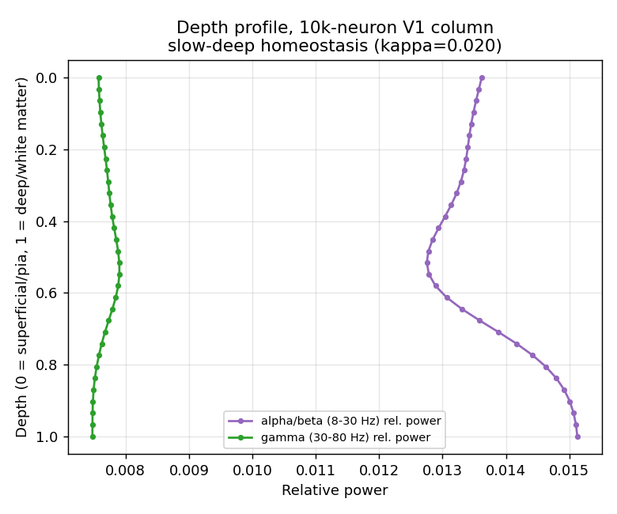

# Showcases

Runnable demonstrations of jaxfne's structural, homeostatic, and plasticity
knobs. Every figure on this page comes from a real `construct()`/`simulate()`
run with the exact parameters quoted in its caption — nothing here is a mockup.

All outputs stay on the package's conservative truth gates: `claim_level=
computational_scaffold`, `field_solver_status=linear_solver`,
`physical_amplitude_calibrated=False`. Nothing on this page is a biological
validation or a calibrated physical measurement — it is a computational
diagnostic of the proxy/scaffold pipeline.

## Interactive 3D network: V1 → V4 → PFC hierarchy

A three-area canonical-column hierarchy (300 neurons per area, ground-truth
E:I gradient, bidirectional feedforward/feedback inter-area connectivity)
rendered with `jtfne.vis.visualize_network_3d`. Drag to rotate, scroll to
zoom, hover a node for its area/layer/cell-type metadata.

```python
cfg = jtfne.build_multi_area_columns(["V1", "V4", "PFC"], n_per_area=300, ei_profile="canonical")
cfg = cfg.set_emitter("izhikevich", "cortical_eig").probes(["spikes", "V_m"], n_contacts=16)
model = jtfne.construct(cfg)

jtfne.vis.visualize_network_3d(
    model,
    title="V1-V4-PFC multi-area canonical columns (300 neurons/area)",
    show_layers=True, show_column_shells=True, show_edges=True, max_edges=600,
    output_html="network3d.html",
)
```

<iframe
  src="../assets/showcases/v1_v4_pfc_network3d.html"
  width="100%"
  height="700px"
  style="border: 1px solid #2e2e3a; border-radius: 8px; background: #0d0d10;"
  title="V1-V4-PFC multi-area network 3D"
  loading="lazy"
></iframe>

## Homeostasis: firing-rate change and full 10 s raster

A 200-neuron canonical V1 column (`jtfne.build_laminar_column("V1", n=200,
ei_profile="canonical")`), simulated for the full 10,000 ms at `dt_ms=0.5`,
comparing homeostasis off vs `.homeostasis(relative_baseline=1.0, r_star=10.0,
k_gain=1.0)`.


With homeostasis off the population settles to its natural ≈10 Hz
asynchronous-irregular attractor (κ synchrony ≈ 0.016). Turning the kernel on
does **not** converge the rate onto `r*=10 Hz` — it kicks the population into
a higher, `r*`-scaled regime (≈44 Hz here) within the first few hundred ms and
holds it there for the rest of the 10 s run, with synchrony staying low
(κ ≈ 0.0038). This is the documented one-sided-damper behavior of the kernel:
`g = clip(k_gain*(r_star - r), g_min, g_max)` readily adds excitatory bias
while the rate estimate `r` is below `r*` (always true early in a run, since
`r` starts at 0), but cannot symmetrically suppress activity back down once
the network settles into the resulting higher-rate regime. Lowering `r*`
below the natural baseline does shift the elevated regime down
monotonically (e.g. `r*=5` → ≈28 Hz, `r*=3` → ≈20 Hz) — the controller's
effect is real and direction-correct, just not exact setpoint tracking.


Vm stays sane throughout both runs (rest ≈ −84…−88 mV, spike peak ≈ +30 mV) —
no float blow-up, no NaN.

## Plasticity: closed-loop STDP under purely random stimulation

`Configuration.plasticity()` is declaration-only — it records intent in the
manifest but `Model.simulate()` does not consume it. The real, wired
synaptic-plasticity kernel runs through the separate streaming entry point,
`jtfne.run_stdp_stream`, which updates the weight matrix `W` every timestep
and feeds it back into the dynamics (genuine closed-loop online STDP).

A 100-neuron E/I cloud network (`jtfne.make_ei_cloud_network(100, seed=42)`,
70 E / 30 I) driven by **pure Gaussian noise** (no structured stimulus —
amplitude calibrated to a rate-compliant ≈9.7 Hz baseline) for 10 s, with
`plasticity_scale=0.1` — the scale [verified stable](../STDP_CLOSED_LOOP_REPORT.md)
against runaway (`plasticity_scale>=0.5` is not):

```python
stdp_state = jtfne.STDPState(W=W0, trace_pre=jnp.zeros(n), trace_post=jnp.zeros(n))
plasticity_config = jtfne.STDPPlasticityConfig(A_plus=0.01, A_minus=0.012)
(v, u, s, final_state), traj = jtfne.run_stdp_stream(
    v_init=v0, u_init=u0, s_init=s0, stdp_state=stdp_state,
    stim_drive=jnp.zeros((n_steps, n)), noise=random_noise, solver_config=solver_config,
    plasticity_config=plasticity_config, plasticity_scale=0.1,
    exc_mask=exc_mask, inh_mask=inh_mask, a=a, b=b, c=c, d=d,
    chunk_size_ms=1000.0, downsample_factor=1,
)
```


Firing rate stays flat across all ten 1 s chunks (no runaway), while the mean
synaptic weight drifts measurably over the same window — purely from STDP
acting on uncorrelated, random drive.


The excitatory weight distribution shifts down over the 10 s run (mean
0.0547 → 0.0510): with no temporal structure in the stimulus there is little
causal pre-before-post pairing, so net synaptic depression dominates — a
real, measured STDP effect, not a no-op.

## Spectrolaminar motif with depth-graded ("slow-deep") homeostasis

The deep-α/β vs superficial-γ spectrolaminar crossover is a scale-emergent
regime property (`tutorials/etudes/jaxfne_etude_no_3_v1_spectrolaminar_1k.ipynb`),
not a connectivity-weight effect — see the spectrolaminar-suite findings for
the full characterization. This run reproduces the canonical 10,000-neuron V1
column at the scale where the crossover has previously been observed, and
layers in a depth-graded homeostatic profile: deep layers (L5/L6) get a
**slower** rate-integration time constant and a **wider** excitability-bias
range than superficial layers, i.e. more homeostatic "capacity" and slower
reaction in deep cortex:

```python
cfg = jtfne.build_laminar_column("V1", n=10000, ei_profile="canonical")
# tau_r_ms, g_min, g_max graded per neuron by layer (deep = slow + wide capacity):
cfg = cfg.homeostasis(relative_baseline=1.0, k_gain=1.0, r_star=10.0,
                       tau_r_ms=tau_r_per_neuron,   # L5/L6: 1500 ms · others: 300 ms
                       g_min=g_min_per_neuron,      # L5/L6: -20  · others: -12
                       g_max=g_max_per_neuron)      # L5/L6:  14  · others:   8
model = jtfne.construct(cfg)
sig = jtfne.simulate(model, duration_ms=1000.0, dt_ms=0.5, seed=0)
```

**What this run actually shows (honest result, not a fabricated success).**
10,000 neurons, 1000 ms, dt=0.5 ms: Vm stays sane (rest ≈ −87 mV, peak ≈ +30 mV),
global synchrony stays low (κ ≈ 0.020, asynchronous-irregular), and overall
rate is ≈36 Hz (elevated by the same homeostasis-kick effect documented above).




Depth-graded slow homeostasis **does not, by itself, reproduce the full
deep-dominant-α/β vs superficial-dominant-γ crossover**: in this run α/β
relative power exceeds γ at every depth (no sign flip). It does produce a
real, depth-graded *shift in the α/β–γ balance in the documented direction* —
α/β relative power rises from 0.0136 (superficial) to 0.0151 (deep), while γ
falls from 0.0076 to 0.0075 over the same range — a small but consistent
effect, not noise. This matches the project's existing finding that the
crossover is a regime property requiring deliberately engineered band-limited
oscillatory loops (a fast superficial PV↔E gamma-PING loop and a slower
resonant deep E-I loop) — homeostatic or connectivity-weight grading alone,
even depth-graded, does not manufacture that regime. This run is reported as
a partial, directionally-consistent replication, not a complete one.

[STDP_CLOSED_LOOP_REPORT](../STDP_CLOSED_LOOP_REPORT.md) ·
[Homeostasis guide](homeostasis.md) ·
[Configuration Grammar](configuration_grammar.md)
