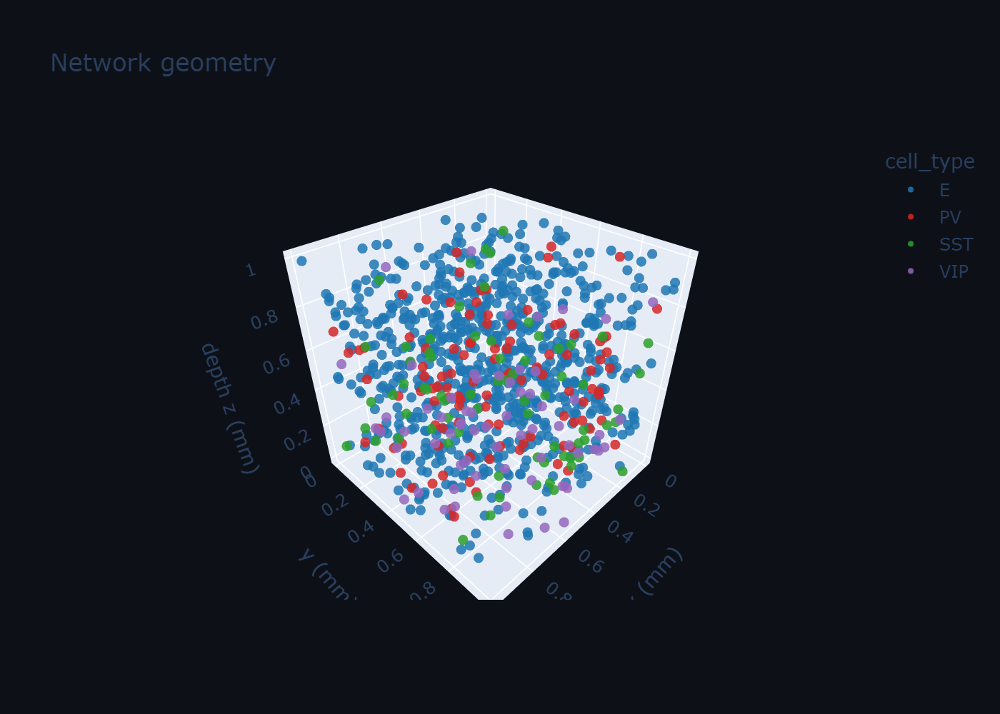
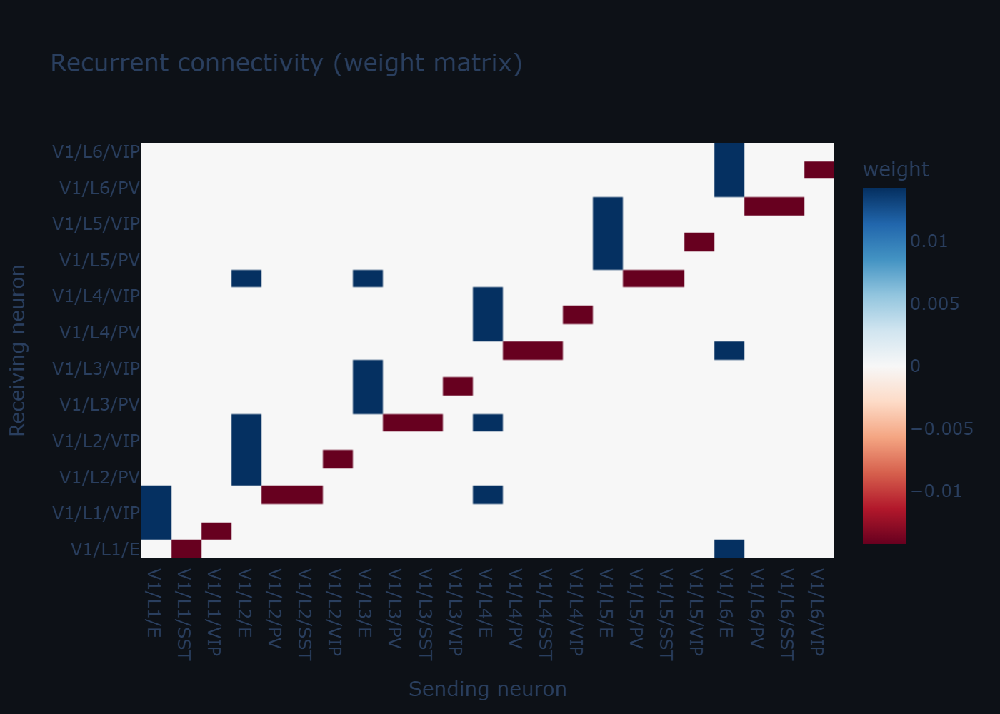
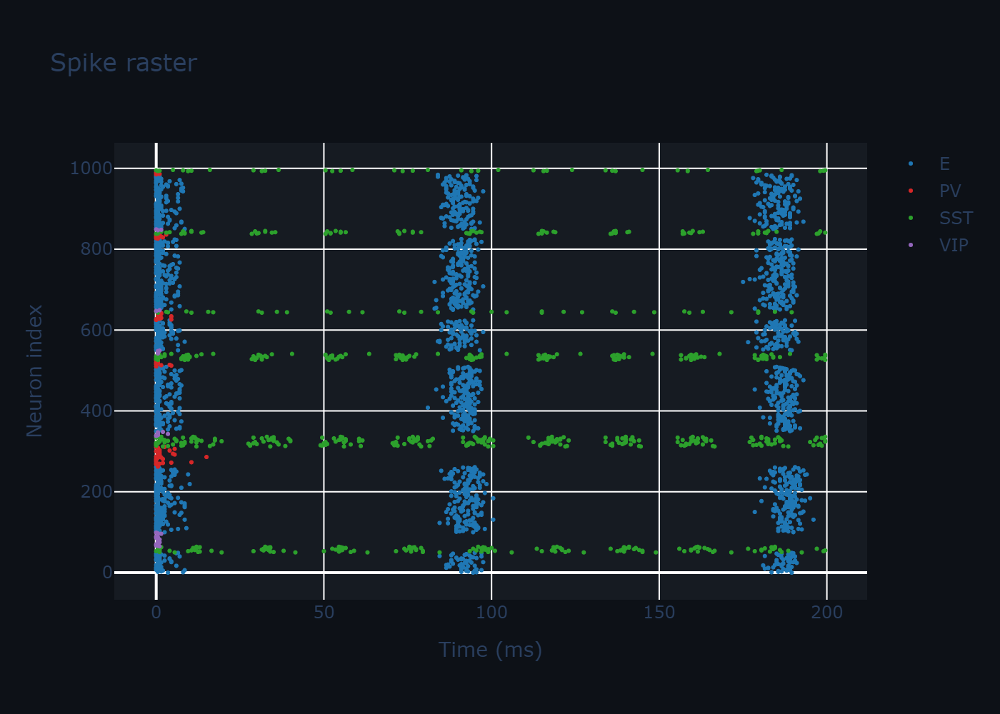
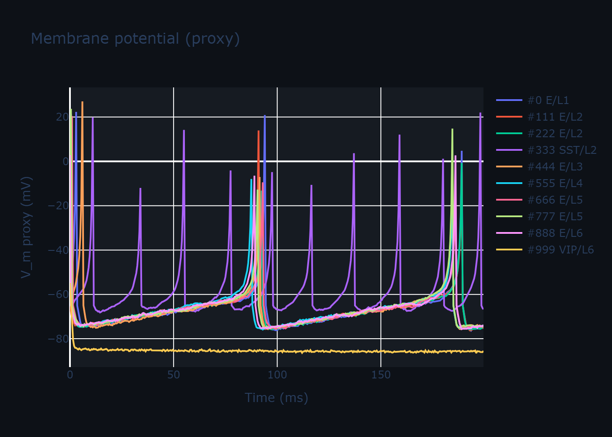
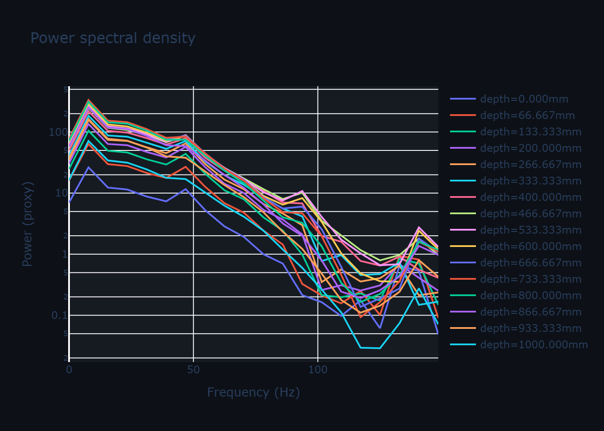
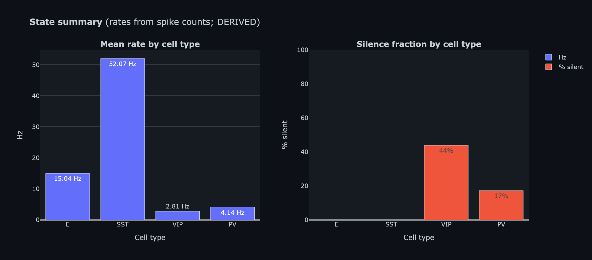

# jaxfne

**Tensor-Field Neural Equations (TFNE)** — JAX simulation for layer-resolved neural
circuits, source operators, field proxies, probes, objectives, and evidence.

**Scientific grammar:** Emitter → Source → Field → Probe → Objective → Optimizer → Manifest

**Execution grammar:** CircuitSpec → `construct` → `Model` → `simulate` → `Signals`

`CircuitSpec` is a **conceptual category** (`Configuration | NeuronalTensor`),
not a concrete production class; the experimental `experimental_hpc.CircuitSpec`
is an unrelated type not accepted by `construct`.

[Jaxley](https://jaxley.readthedocs.io) provides compartmental biophysical detail;
jaxfne provides population/field-scale circuits and proxy readouts. Jaxley models
attach as emitters via [Jaxley interoperability](guides/jaxley_interop.md).

[Scope & status](scope_and_status.md) · [Public API contract](public_surface_contract.md) (0.4.13)

## Install

```bash
pip install -U jaxfne
pip install "jaxfne[viz]"
```

## Minimal example

```python
import jaxfne as jtfne

jtfne.enable_x64()
tensor  = jtfne.load_canonical_neuronal_tensor("canonical-v1-column-1000n")
model   = jtfne.construct(tensor, jtfne.RuntimeConfiguration(seed=0, duration_ms=1000.0, dt_ms=0.5))
signals = jtfne.simulate(model)
```

> `canonical-v1-column-1000n` fractions (`L1 E 0.50` etc.) and typed motifs are scaffold values (`value_tag="relative"`), not quantitatively calibrated; `E`/`PV`/`SST`/`VIP` are reduced-emitter scaffold identities — see [Scope & status](scope_and_status.md#biological-calibration-status-canonical-v1-column). `qualitative_laminar_scaffold = true`, `quantitative_cell_fraction = false`, `quantitative_connectivity = false`.

## Main pages

- [Quickstart](quickstart.md) — build paths, paradigms, H-state adaptation
- [Tutorials](tutorials/index.md) — usage of the grammar
- [Canonical Atlas Suite](guides/atlas_suite.md) — 6-panel interactive visual grammar
- [Études](etudes/index.md) — demonstrated scientific propositions
- [API reference](api/index.md)
- [H-state / HDP guide](guides/hdp.md)

## Canonical Visualization Atlas

The JaxFNE Canonical Atlas provides a unified 6-panel visual grammar (`network_3d`, `connectivity`, `raster`, `traces`, `spectral`, `state_summary`) with strict evidence-level separation (**OBSERVED** vs. **DERIVED**), deterministic degradation tracking, and cryptographic manifest provenance.

Every preview below is generated directly from realized JaxFNE simulation outputs (`canonical-v1-column-1000n` scaffold):

<table>
  <tr>
    <td align="center" width="50%">
      <a href="guides/atlas_suite.md">
        
      </a><br>
      <sub><b>1. Network 3D</b> (OBSERVED): Realized 3D geometry, lamina, cell classes, sampled synaptic edges</sub>
    </td>
    <td align="center" width="50%">
      <a href="guides/atlas_suite.md">
        
      </a><br>
      <sub><b>2. Connectivity</b> (OBSERVED): Realized synaptic weight matrix & adjacency</sub>
    </td>
  </tr>
  <tr>
    <td align="center" width="50%">
      <a href="guides/atlas_suite.md">
        
      </a><br>
      <sub><b>3. Spike Raster</b> (OBSERVED): Microsecond spike timestamps across realized neuronal populations</sub>
    </td>
    <td align="center" width="50%">
      <a href="guides/atlas_suite.md">
        
      </a><br>
      <sub><b>4. Membrane Traces</b> (OBSERVED): Somatic membrane potential $V_m$ trajectories</sub>
    </td>
  </tr>
  <tr>
    <td align="center" width="50%">
      <a href="guides/atlas_suite.md">
        
      </a><br>
      <sub><b>5. Spectral</b> (DERIVED): Welch PSD & spectrolaminar power estimates</sub>
    </td>
    <td align="center" width="50%">
      <a href="guides/atlas_suite.md">
        
      </a><br>
      <sub><b>6. State Summary</b> (DERIVED): Cell-type rate distributions and silence fractions</sub>
    </td>
  </tr>
</table>

Generate the complete standalone HTML atlas suite locally with one line:

```python
import jaxfne as jtfne
from jaxfne.vis import build_atlas

# Run simulation
tensor = jtfne.load_canonical_neuronal_tensor("canonical-v1-column-1000n")
model = jtfne.construct(tensor, jtfne.RuntimeConfiguration(seed=0, duration_ms=500.0, dt_ms=0.5))
signals = jtfne.simulate(model)

# Build canonical atlas with manifest & standalone interactive HTML panels
manifest = build_atlas(model, signals, out_dir="docs/_static/atlas")
print(f"Atlas generated with SHA256: {manifest['sha256']}")
```

For detailed documentation, see the [Canonical Atlas Suite Guide](guides/atlas_suite.md).
