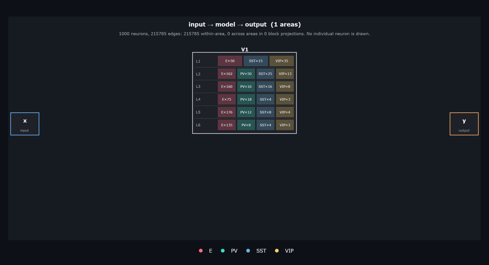
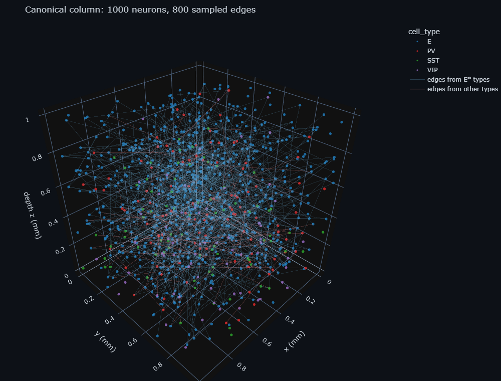
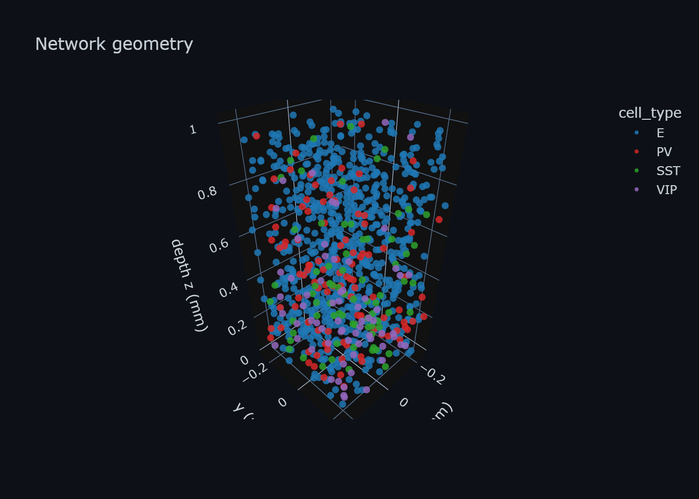
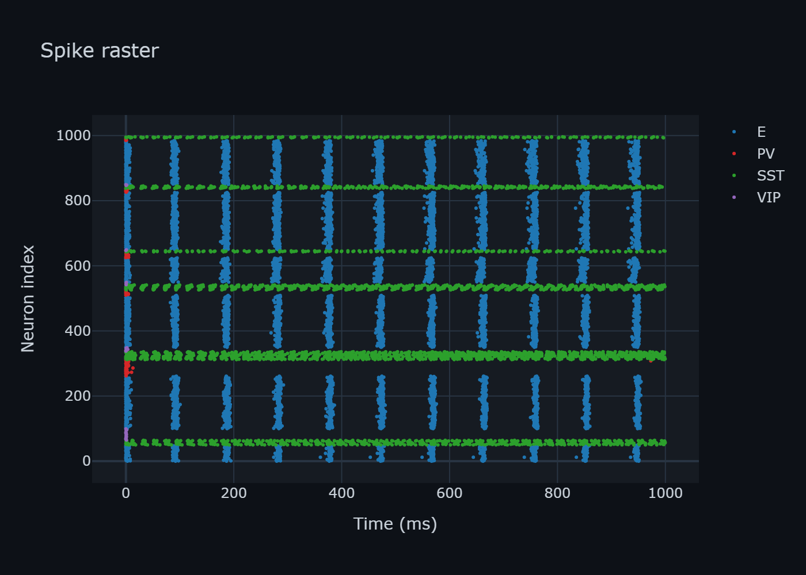
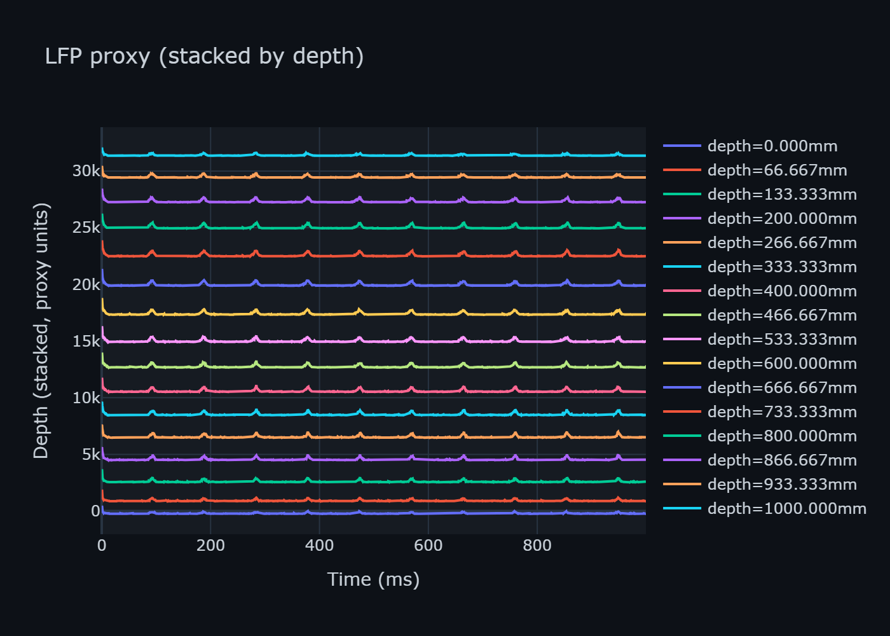
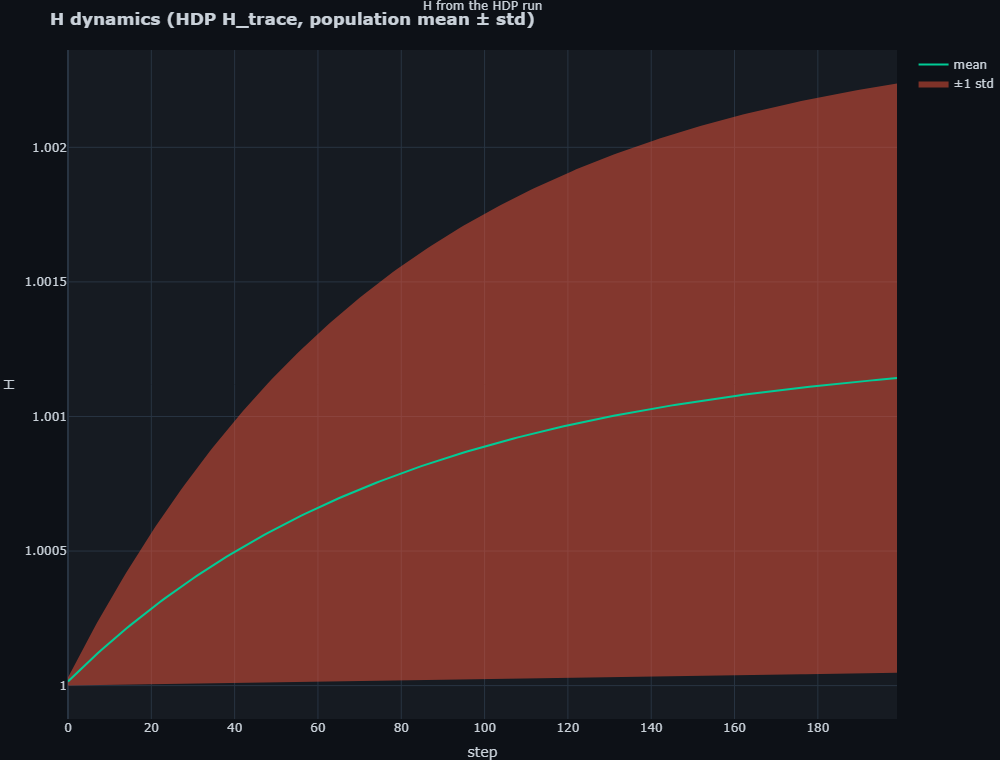
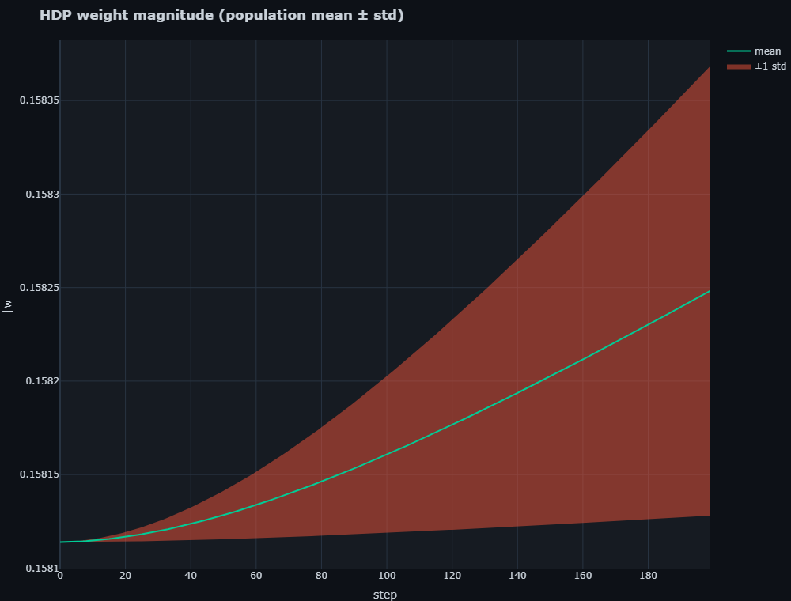
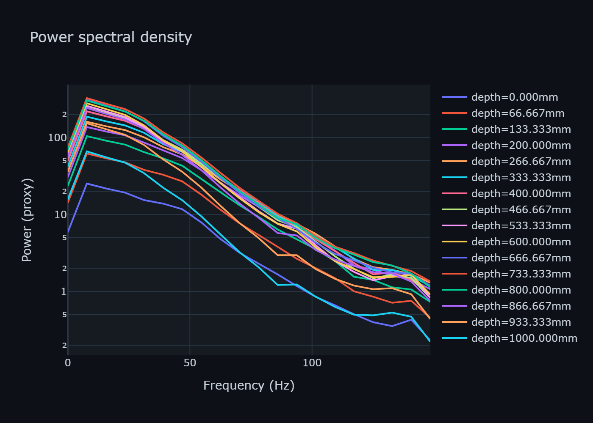
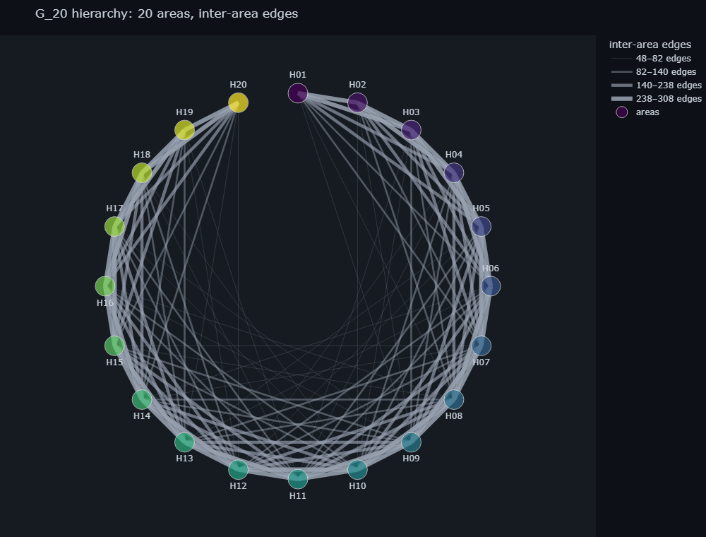

# Tutorials

One track, one model. Eight steps take the canonical 1000-neuron column
`canonical-v1-column-1000n` from its generative rules to a comparison against
nulls, and every step reuses the object the previous one produced.

<div class="mermaid">
flowchart LR
  G["PseudoGenome<br/>01 define"] -->|"develop(K_D)<br/>02"| N["NeuronalTensor<br/>03 inspect"]
  N -->|"construct(K_S)<br/>04"| M["Model"]
  M -->|"simulate<br/>04"| S["Signals"]
  S -->|"05 observe"| F["Fields & probes"]
  M -->|"06 add state"| H["H (RBS)"]
  H -->|"07 add dynamics"| W["HDP: dW/dt"]
  S -->|"08 compare"| C["Nulls & lesions"]
</div>

<div class="jx-cards">
  <a href="01_define_genome/"><strong>01 Define</strong><br/>PseudoGenome rules</a>
  <a href="02_develop_genome/"><strong>02 Develop</strong><br/>Genome → tensor</a>
  <a href="03_inspect_tensor/"><strong>03 Inspect</strong><br/>Realized vs configured</a>
  <a href="04_simulate_tensor/"><strong>04 Simulate</strong><br/>construct → Signals</a>
  <a href="05_observe_fields/"><strong>05 Observe</strong><br/>Fields and probes</a>
  <a href="06_add_state/"><strong>06 Add state</strong><br/>H / RBS container</a>
  <a href="07_add_dynamics/"><strong>07 Add dynamics</strong><br/>HDP adaptation</a>
  <a href="08_compare_nulls/"><strong>08 Compare</strong><br/>Nulls and lesions</a>
</div>

```python
import jaxfne as jtfne

genome = jtfne.load_canonical_pseudogenome("canonical-v1-column-1000n")  # 01 define
tensor = jtfne.develop(genome, seed=0)                                   # 02 develop (K_D)
model = jtfne.construct(tensor, jtfne.RuntimeConfiguration(seed=1, duration_ms=1000.0, dt_ms=0.5))  # 04 (K_S)
signals = jtfne.simulate(model)                                          # same compiler for every on-ramp
```

Smoke mode (`SMOKE=1`, `n≈100`, `duration_ms≈100`) runs in about 30 s; the
documented path is 1000 neurons, `duration_ms=1000.0`, `dt_ms=0.5`. Development
and runtime keys are distinct (`K_D ≠ K_S`; see the [PseudoGenome guide](../guides/jdna.md)).

| # | Step | Topic | Focus | Reuses |
|---|------|-------|-------|--------|
| [**01**](01_define_genome.md) | define | PseudoGenome | `validate_genome`, `genome_rules_hash`, `declared_constraints`, tolerance bands | — |
| [**02**](02_develop_genome.md) | develop | Genome → phenotype | `develop(G,K_D)` determinism, seed jitter within bands, `phenotype_sha256` | `genome` |
| [**03**](03_inspect_tensor.md) | inspect | Realized vs configured | `neuron_table()`, per-layer counts, 48 rules, `save/load_neuronal_tensor` | `tensor` |
| [**04**](04_simulate_tensor.md) | simulate | Construct → Signals | `construct(tensor, RuntimeConfiguration)` → `simulate`; `EdgeList.n_edges≈215k`, `Pose3D` positions | `tensor` |
| [**05**](05_observe_fields.md) | observe | Fields and probes | LFP/CSD/EEG/MEG/PSD on the frozen `X,Q`; `K_a≠K_b ⇒ Y_a≠Y_b` | `model, signals` |
| [**06**](06_add_state.md) | add state | H / RBS | `PlasticParams.H` → `h_state`, `with_hdp_initial_state`, checkpoint/restore | `tensor, model` |
| [**07**](07_add_dynamics.md) | add dynamics | HDP | `enable_hdp` (`DEFAULT_HDP` vs `DESYNC`), `H_trace/w_trace`, `K_HDP/K_ctrl/K_w_ctrl` | `model` |
| [**08**](08_compare_nulls.md) | compare | Nulls, lesions | shuffled, `LESION_SPEC`, multi-area 3000n via `merge_neuronal_tensors`, `kappa` | all |

The step table with receipts is audited in `artifacts/audit/tutorial_cumulative_audit.md`.
The fluent `Configuration` builder is the other on-ramp; both converge on
`construct → simulate` ([Configuration Grammar](../guides/configuration_grammar.md)).
`NeuronalTensor` is the declarative `Areas × Layers × NeuronTypes` object the track
carries; see the [API reference](../api/neuronal_tensor.md) and the
[H-state / HDP guide](../guides/hdp.md).

## Scale: from one column to twenty areas

The same language builds the 20-area hierarchy used by Atlas AT-10-N20: areas in
hierarchy order, one chord per connected pair, chord width by edge count.

=== "Still"

    

=== "Interactive"

    <iframe class="jx-frame" src="../../_static/visuals/area_graph_n20.html" loading="lazy" title="G_20 area graph"></iframe>

[Open full page](../_static/visuals/area_graph_n20.html). Reference atlas of the
1000 ms column run: [index](../_static/atlas/index.html) · [schema](../_static/atlas/schema.html) · [3D](../_static/atlas/network_3d.html) · [raster](../_static/atlas/raster.html) · [LFP](../_static/atlas/lfp.html) · [oscillatory](../_static/atlas/oscillatory.html).

## Suites

Single-notebook courses that each cover a full workflow arc.

| Suite | Topic | Focus |
|-------|-------|-------|
| **[Suite 1](06_jaxfne_suite_no_1_computational_biophysics.md)** | Computational biophysics | Single neurons → vectorized circuits → laminar readouts → optimization |
| **[Suite 2](07_jaxfne_suite_no_2_spectrolaminar_motif.md)** | Spectrolaminar motif | Column anatomy → population simulation → multimodal proxies |
| **[Suite 2 (Evoked L4)](08_jaxfne_suite_no_2_evoked_l4_drive.md)** | Evoked L4 drive | Baseline-vs-driven L4 contrast |
| **[Suite 3](08_jaxfne_suite_no_3_low_frequency_scaling.md)** | Low-frequency scaling | Scale-dependent PSD, bandpower, synchrony |

[](https://colab.research.google.com/github/HNXJ/jaxfne/blob/main/artifacts/tutorials/jaxfne_suite_no_1_computational_biophysics.ipynb)
[](https://colab.research.google.com/github/HNXJ/jaxfne/blob/main/artifacts/tutorials/jaxfne_suite_no_2_spectrolaminar_motif.ipynb)
[](https://colab.research.google.com/github/HNXJ/jaxfne/blob/main/artifacts/tutorials/jaxfne_suite_no_3_low_frequency_scaling.ipynb)

All notebooks follow the [Colab notebook standard](notebook_standard.md).
Frozen scientific demonstrations are the **[Études](../etudes/index.md)**, not tutorials.

??? note "Archive: earlier stand-alone tutorials (superseded by the track)"

    | # | Topic | Where it lives in the track |
    |---|-------|-----------------------------|
    | [01](01_single_neuron_multimodal.md) | Single-neuron multimodal | Contrast box in 03 |
    | [02](02_two_neuron_ei.md) | Two-neuron E/I | Contrast box in 03 |
    | [03](03_network_100_ei.md) | 100-neuron network | Smoke preamble for 02–05 |
    | [04](04_v1_column.md) | V1 six-layer column (600n) | Replaced by the 1000n column in 01 |
    | [06](06_v036_100_neuron_ei_population.md) | Chainable Configuration | On-ramp box in 04 |
    | [07](07_v037_source_bookkeeping.md) | Source bookkeeping | 05 §1 |
    | [08](08_v038_lfp_csd_readout.md) | LFP/CSD readout | 05 §2 |
    | [09](09_v0310_eeg_meg_emm_proxy_bundle.md) | EEG/MEG/EMM proxies | 05 §3 |
    | [10](10_v0313_omission_oddball.md) | Omission and oddball | Variant box in 08 |
    | [05](05_v1_pfc_dual_column.md) | V1–PFC dual column | Multi-area variant in 08 |
    | [11](11_multi_laminar_cortical_agsdr.md) | Multi-area laminar model | Tuning in 07, knock-out in 08 |
    | [12](12_izhikevich_single_emitter_explorer.md) | Izhikevich explorer | Appendix |
    | [13](13_canonical_column_etude.md) | Canonical cortical column | Cross-links to 01–08 |

## Running

Notebooks live under `tutorials/` (études under `tutorials/etudes/`); headless
runners under `examples/`:

```bash
python examples/v031_single_izhikevich_neuron.py
```

Regenerate the figures on these pages with `python scripts/generate_readme_atlas.py`,
`python scripts/generate_doc_page_atlases.py` and `python scripts/generate_docs_visuals.py`.

Next: [Guides](../guides/index.md) · [API reference](../api/index.md) · [Jaxley interoperability](../guides/jaxley_interop.md)
