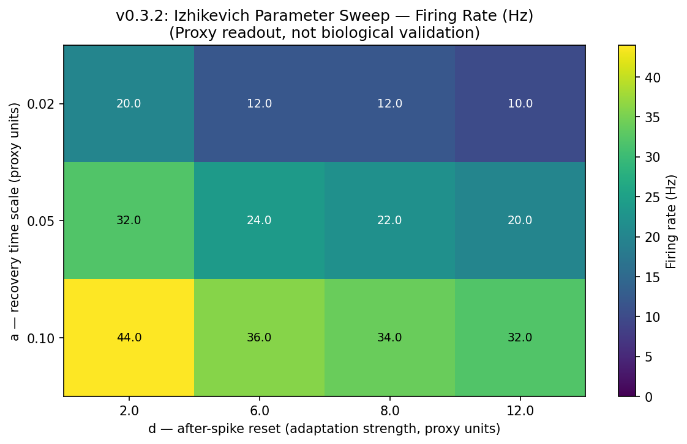
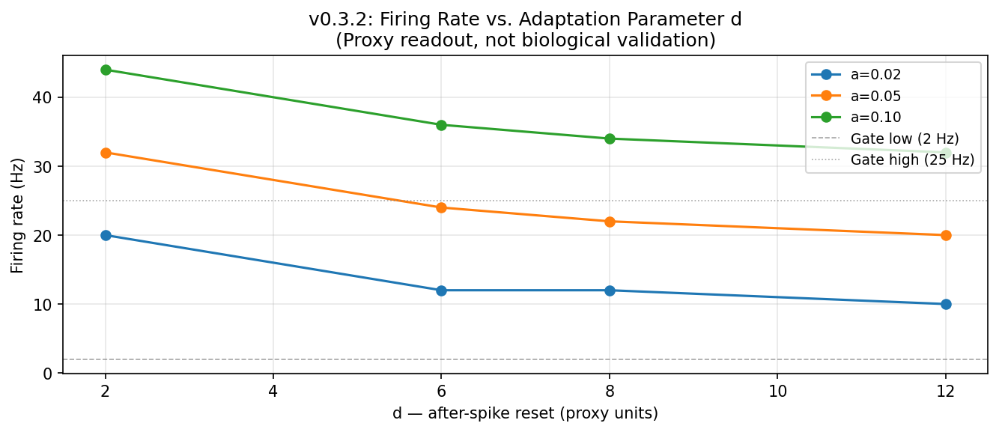

# v0.3.2: Single Neuron Parameter Sweep

[](https://colab.research.google.com/github/HNXJ/jaxfne/blob/main/notebooks/v030/v0302_single_neuron_parameter_sweep.ipynb)

**Tutorial ID:** v0302_single_neuron_parameter_sweep  
**jaxfne version:** 0.2.30  
**Truth status:** `truth_safe_unverified`  
**Claim level:** `computational_scaffold`  
**Scenario ID:** v030_02_single_neuron_parameter_sweep  

---

## Section 1: Learning Objectives

After completing this tutorial, you will be able to:

1. Use `jtfne.with_emitter_parameters()` to modify Izhikevich parameters on an existing model.
2. Run a grid sweep over `a` (recovery time scale) and `d` (after-spike reset) parameters.
3. Observe how parameter changes shift proxy firing rates without biological overclaims.
4. Read the atlas manifest and confirm all claim gates are preserved across a multi-point sweep.
5. Distinguish computational regime transitions from validated biological neural subtypes.

---

## Section 2: Biological/Computational Question

**Question:** How do the Izhikevich recovery parameters `a` and `d` affect proxy firing rate in the jaxfne single-neuron scaffold?

**Computational framing:**  
This tutorial sweeps `a` (time scale of recovery variable) and `d` (after-spike reset increment) across a small grid. The resulting firing rates are proxy computational outputs — they show parameter sensitivity within the Izhikevich model, not calibrated neural firing behavior.

The key tool is `jtfne.with_emitter_parameters(model, a=..., d=...)`, which returns a new model with overridden parameters without mutating the original.

**What this does NOT claim:**  
That the parameter grid corresponds to named biological neuron subtypes (RS, FS, IB, CH). Those regime labels require calibration against empirical data, which is not provided here.

---

## Section 3: Mathematical Glossary

### Izhikevich Dynamics

$$\frac{dv}{dt} = 0.04v^2 + 5v + 140 - u + I(t)$$

$$\frac{du}{dt} = a(bv - u)$$

**Reset rule:** when $v \geq 30$ mV:

$$v \leftarrow c, \quad u \leftarrow u + d$$

**Term Glossary:**

| Symbol | Meaning | Units | Status in this tutorial |
|--------|---------|-------|------------------------|
| $v$ | Membrane voltage | mV (model units) | Simulated |
| $u$ | Recovery variable | — | Simulated |
| $a$ | Recovery time scale | ms⁻¹ (proxy) | Swept |
| $b$ | Subthreshold sensitivity | — | Fixed (preset) |
| $c$ | After-spike voltage reset | mV (model units) | Fixed (preset) |
| $d$ | After-spike recovery reset | — | Swept |
| $I(t)$ | Drive current | pA (proxy, uncalibrated) | Fixed (preset) |

**Worded equation for $a$:** Larger `a` → faster recovery variable dynamics → shorter refractory-like suppression → higher proxy firing rate.

**Worded equation for $d$:** Larger `d` → stronger after-spike recovery increment → more adaptation → lower proxy firing rate (opposite effect to `a`).

**Implementation:** `jtfne.with_emitter_parameters(model, a=..., d=...)` → `model.simulate(sim)`

**Claim boundary:** These are model-internal dynamics. No claim is made about correspondence to patch-clamp measurements or in vivo firing rates.

For the full equation glossary, see [Mathematical Glossary Flow](../mathematical_glossary_flow.md).

---

## Section 4: Canonical Import

```python
# Install (Colab)
# !pip install jaxfne==0.2.30

import jaxfne as jtfne
import jax.numpy as jnp
import numpy as np
import json
```

---

## Section 5: Configuration

The base model uses the identical configuration as v0.3.1 — `cortical_eig` preset, `isolated_neuron`, 16-contact laminar proxy probe:

```python
run = jtfne.runtime(device_type="auto", dtype="float32", x64_enabled=False, seed=42)

cfg = (
    jtfne.configuration()
    .network(name="v030_02_parameter_sweep", kind="isolated_neuron", n=1, cell_types={"E": 1.0})
    .emitter(family="izhikevich", preset="cortical_eig")
    .field(domain="laminar_column", conductivity="proxy", boundary="mean_zero_neumann", gauge="mean_zero")
    .probe(name="single_channel_16contact", modes=["spikes", "V_m", "source", "LFP", "CSD"], n_contacts=16)
)

base_model = jtfne.construct(cfg)
```

**cortical_eig preset baseline:** `a=0.02`, `b=0.2`, `c=-65`, `d=8`, `drive=5` (all proxy units).

---

## Section 6: Simulation — Parameter Sweep

`with_emitter_parameters` returns a new, immutable model with overridden parameters. The original is not mutated:

```python
sim_spec = jtfne.simulation(duration_ms=500.0, dt_ms=0.1, seed=42, runtime=run)

A_VALUES = [0.02, 0.05, 0.10]
D_VALUES = [2.0, 6.0, 8.0, 12.0]

sweep_results = []
for a_val in A_VALUES:
    for d_val in D_VALUES:
        model = jtfne.with_emitter_parameters(base_model, a=a_val, d=d_val)
        signals = model.simulate(sim_spec)
        spikes = np.array(signals.spikes)
        n_spikes = len(np.where(spikes[:, 0] > 0.5)[0])
        firing_rate_hz = (n_spikes / 500.0) * 1000.0
        sweep_results.append({"a": a_val, "d": d_val, "firing_rate_hz": firing_rate_hz})
```

12 points × 500 ms each. All V_m values finite ✓

---

## Section 7: Probe and Readout

The baseline point (`a=0.02`, `d=8`) provides the representative embedded probe report (all 8 operators). The sweep-wide manifest summarises all 12 points via `sweep_results`.

```python
# Representative readout at baseline
baseline_model = jtfne.with_emitter_parameters(base_model, a=0.02, d=8.0)
baseline_signals = baseline_model.simulate(sim_spec)
readout = baseline_model.probe(baseline_signals, modes=["spikes", "V_m", "source", "LFP", "CSD"])
```

---

## Section 8: Manifest and Claim Gates

```python
manifest = {
    "basis": {
        "truth_mode": "truth_safe_unverified",
        "claim_level": "computational_scaffold",
        "field_solver_status": "laminar_proxy_no_pde",
        "physical_amplitude_claim_allowed": False,
        "biological_metabolism_claim_allowed": False,
    },
    ...
}
json.dumps(manifest, allow_nan=False)
print("manifest: JSON-safe ✓")
```

Expected:
```
truth_mode          : truth_safe_unverified
claim_level         : computational_scaffold
field_solver_status : laminar_proxy_no_pde
physical_amplitude  : False
manifest: JSON-safe ✓
```

---

## Section 9: Figures

### Firing Rate Heatmap (a × d grid)



*Proxy firing rate (Hz) across the 3×4 sweep grid. Rows = `a` values (recovery speed); columns = `d` values (adaptation strength). Larger `a` → higher rate; larger `d` → lower rate. Amplitudes are proxy units. No physical-amplitude or biological-mechanism claim.*

### Firing Rate vs. d (per a value)



*Firing rate as a function of `d` for each `a` value. The grey dashed lines mark the 2–25 Hz acceptance gate. The baseline `cortical_eig` point (a=0.02, d=8) is within the gate at 12 Hz. Proxy readout only.*

**Sweep results (from validated run):**

| a | d=2.0 | d=6.0 | d=8.0 | d=12.0 |
|---|-------|-------|-------|--------|
| 0.02 | 20 Hz | 12 Hz | 12 Hz | 10 Hz |
| 0.05 | 32 Hz | 24 Hz | 22 Hz | 20 Hz |
| 0.10 | 44 Hz | 36 Hz | 34 Hz | 32 Hz |

---

## Section 10: Interpretation

The sweep shows that proxy firing rate increases with `a` and decreases with `d`, consistent with the Izhikevich model's mathematical structure. Larger `a` accelerates the recovery variable, shortening the effective refractory period and allowing faster spiking. Larger `d` increases the post-spike recovery increment, strengthening adaptation and reducing rate. These trends emerge deterministically from the model equations — they are not fitted to neural data. The baseline `cortical_eig` point (a=0.02, d=8, 12 Hz) is within the 2–25 Hz acceptance gate used by the v0.3 atlas collector.

---

## Section 11: Failure Modes

| Failure Mode | Symptom | Mitigation |
|-------------|---------|------------|
| All-zero firing at large `d` | rate = 0 Hz, gate FAIL | Reduce `d`; check drive level |
| Rate explosion at large `a` | rate ≫ 25 Hz, gate margin exceeded | Reduce `a` or `drive_scale` |
| NaN in manifest | `json.dumps` raises ValueError | Check for inf/NaN in signals; use finite inputs |
| Baseline gate FAIL | collector rejects scenario | Verify `a=0.02, d=8` runs with `cortical_eig` preset |
| Collector sees < 2 PASS | v0.3.1 output dir missing | Re-run v0.3.1 script before collector |

---

## Section 12: Exercises

1. Add `c` to the sweep: try `c` in `[-65, -55, -50]`. How does the reset voltage affect firing pattern?
2. Add `drive_scale` to the sweep: try `drive_scale` in `[0.8, 1.0, 1.5]`. How does input gain interact with `d`?
3. Increase `duration_ms` to 1000 ms. Does the heatmap change significantly?
4. Set `seed=1` and re-run. Are results reproducible (same gate outcomes)?
5. Extend to a 5×5 grid. How does computation time scale?

---

## Section 13: What This Tutorial Does NOT Claim

**This tutorial is a computational scaffold.**

Outputs are simulated proxy readouts generated under manifest claim gates. No biological mechanism is proven by this tutorial alone.

Specifically, this tutorial does **not** claim:

- The parameter grid corresponds to named biological neuron subtypes (RS, FS, IB, chattering)
- The Izhikevich `a` and `d` parameters are calibrated against electrophysiology recordings
- Firing rate changes reflect real neural adaptation or spike-frequency accommodation
- The proxy LFP/CSD amplitudes correspond to physical microvolts
- Any regime boundary in this sweep maps to a validated biological transition
- The network dynamics have been validated against any empirical dataset
- Any anatomical or physiological parameter has been calibrated

**To make physical-amplitude, biological, or mechanistic claims, you must supply:**
- Calibration evidence (empirical recordings with known units)
- A solved field (Poisson or Maxwell equations with physical conductivity)
- Validated geometry and boundary conditions
- A peer-reviewed validation protocol

Until these are supplied, all outputs remain computational scaffolds with `physical_amplitude_claim_allowed: False`.

---

**Manifest receipt (v030_02):**

```
truth_mode:                       truth_safe_unverified
claim_level:                      computational_scaffold
field_solver_status:              laminar_proxy_no_pde
physical_amplitude_claim_allowed: False
biological_metabolism_claim_allowed: False
baseline_firing_rate_hz:          12.0
collector_gate:                   PASS
```

See [manifests/v0302_single_neuron_parameter_sweep_manifest.json](./manifests/v0302_single_neuron_parameter_sweep_manifest.json) for the full receipt.
